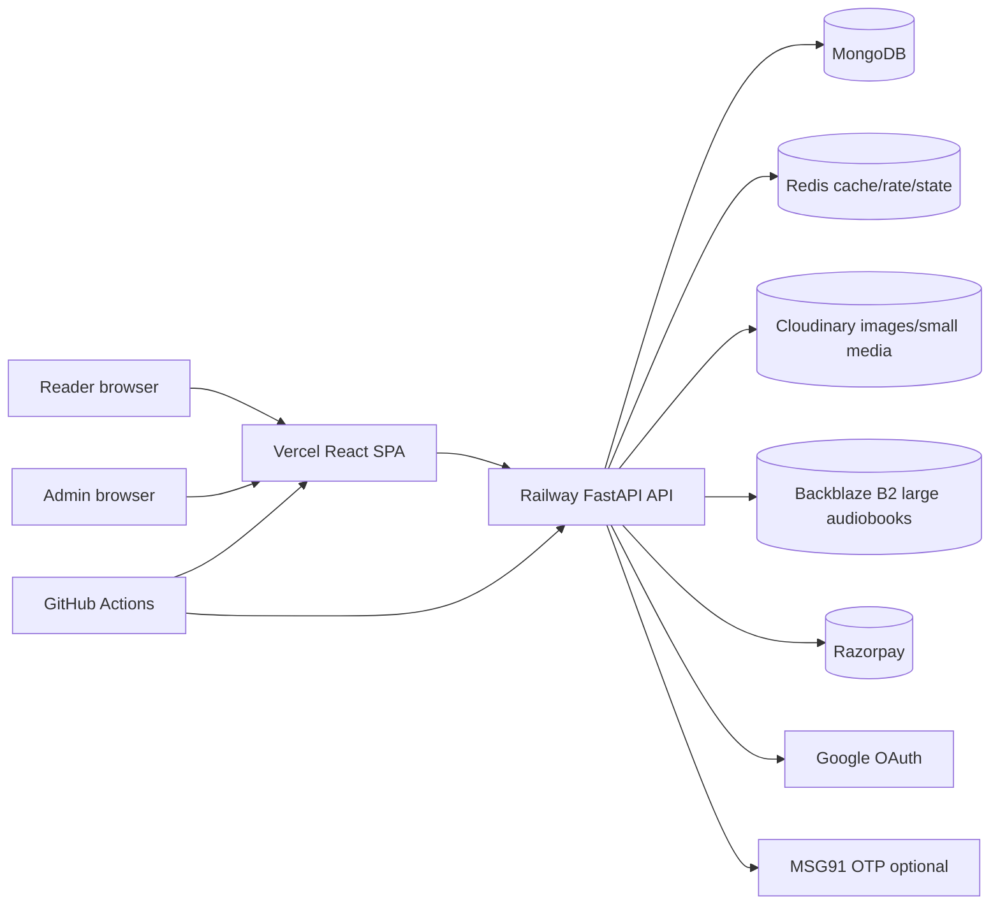
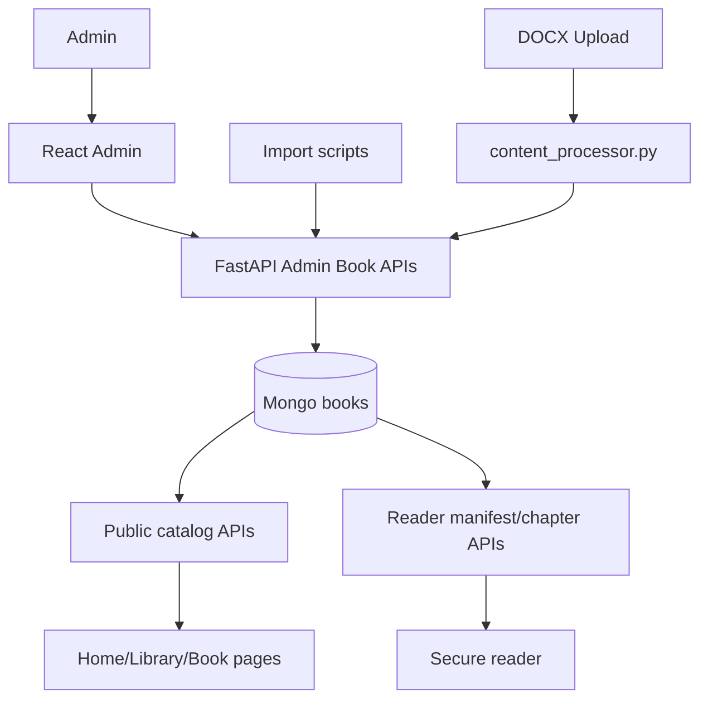
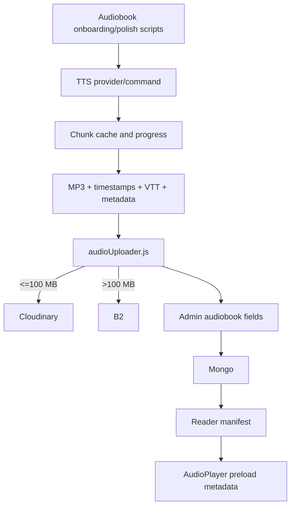
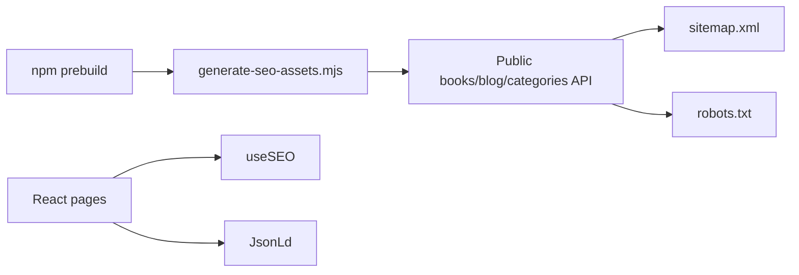
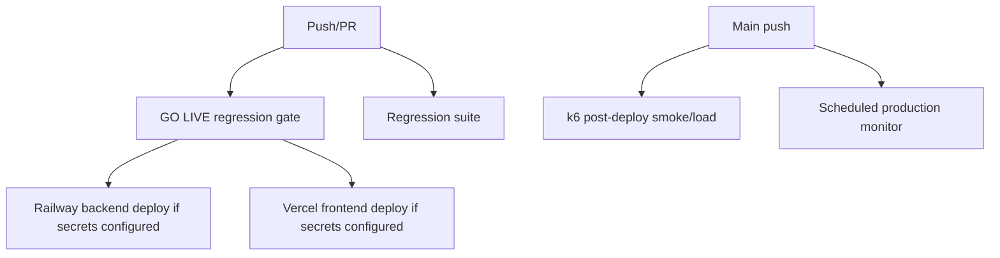

# Earnalism Current Architecture

Generated: 2026-06-17

## Executive Summary

Earnalism is currently a React SPA plus FastAPI/Mongo backend with Redis-aware caching, Razorpay payments, Cloudinary/B2 media storage, admin CMS tooling, audiobook processing scripts, SEO generation, CI regression gates, and production monitoring. It is not yet a complete rights-safe public-domain automation platform, but it already has many of the pieces needed to build one safely in phases.

## Runtime Architecture

## Frontend

Stack:

- React 19
- React Router 7
- CRACO/react-scripts
- Tailwind CSS
- lucide-react icons
- axios
- sonner toast

Primary pages:

- `Home`
- `Library`
- `BookDetail`
- `Reader`
- `Pricing`
- `Account`
- `Journal`
- `JournalArticle`
- `About`
- `Contact`
- `MicroStoryLanding`
- `AdminLogin`
- `Admin`
- `NotFound`

Important frontend conventions:

- Page-level SEO is driven through `useSEO`.
- JSON-LD support exists through `JsonLd`.
- Admin routes are client-side protected through `AuthContext`.
- Reader route is separate from public layout.
- Sitemap/robots are generated during frontend prebuild.

## Backend

Stack:

- FastAPI
- Motor/PyMongo
- Pydantic
- Redis
- Razorpay SDK
- Cloudinary
- B2 via Node storage helper for large audio imports
- Judoscale ASGI middleware when configured

Major backend responsibilities:

- Admin auth and reader auth.
- Book/category/blog/contact/newsletter CMS APIs.
- Secure paid reader chapter access.
- Reading-time wallet and Razorpay payments.
- Public home/catalog APIs with cache.
- Reader metrics and security events.
- Audiobook manifest and B2-aware audio routing.
- Startup database indexes and seed data.
- Growth OS admin control-plane APIs.

## Data Architecture

Main Mongo collections used today:

- `users`
- `user_sessions`
- `books`
- `categories`
- `blog_posts`
- `newsletter`
- `contacts`
- `settings`
- `reading_sessions`
- `reader_completions`
- `reward_claims`
- `topup_intents`
- `payment_webhook_events`
- `wallet_transactions`
- `wallet_ledger`
- `wallet_refunds`
- `wallet_integrity_alerts`
- `analytics_events`
- `reader_security_events`
- `reader_experience_events`
- `admin_upload_audit`
- `credit_log`

Growth OS collections already scaffolded:

- `campaigns`
- `campaign_variants`
- `experiments`
- `leads`
- `institutions`
- `creators`
- `outreach_sequences`
- `messages`
- `support_tickets`
- `agent_runs`
- `agent_actions`
- `guardrail_results`
- `tool_calls`
- `incidents`
- `budgets`
- `metrics_snapshots`
- `audit_logs`
- `feature_flags`

Current book model:

- Book metadata and chapters are embedded in one document.
- `rights_metadata` can be accepted on admin input but is not yet structured or enforced.
- Public book metadata intentionally strips rights metadata and chapter bodies.
- Reader chapter content is delivered through gated reader endpoints.

## Content Flow Today

## Audiobook Flow Today

## SEO Flow Today

## CI/CD Architecture

## Existing Automation Building Blocks

- `scripts/import_books.py`: dry-run-first source import and boilerplate stripping.
- `scripts/bulk_publishing_pipeline.py`: orchestrated publishing pipeline wrapper.
- `scripts/open_source_audiobook_onboarding.py`: synced audiobook generation/onboarding.
- `scripts/audio/polishBengaliAudiobooks.js`: Bengali audiobook polish pipeline.
- `scripts/audio/polishEnglishAudiobooks.js`: English audiobook polish pipeline.
- `scripts/audio/cleanupAudiobookStorage.js`: orphaned audio cleanup reporting/deletion.
- `scripts/production_monitor.mjs`: production health and latency observer.
- `regression/`: modular go-live/regression suite.
- `docs/growth-os-architecture.md`: deterministic Growth OS control plane.

## Target Automation Architecture Fit

The approved Automation System should be layered on top of this architecture rather than replacing it:

1. Add catalog audit/governance collections and scripts.
2. Add structured rights objects and deterministic rights verifier.
3. Add demand scoring and priority queue.
4. Add source ingestion/artifact cache collections.
5. Add Earnalism Edition artifact generation with source-hash/prompt-version cache keys.
6. Add visual/audio QA as first-class backend records.
7. Add publishing workflow state machine.
8. Extend Growth OS daily loop to orchestrate dry-run jobs only after gates exist.

## Architectural Decision For Phase 1

Use MongoDB for Phase 1 catalog audit artifacts because:

- The backend already uses MongoDB.
- Startup index patterns already exist.
- The audit is document-shaped and report-oriented.
- Introducing PostgreSQL now would increase operational risk without improving Phase 1 outcomes.

If relational reporting becomes necessary later, add a warehouse/export layer after the source-of-truth governance models stabilize.
