# The Earnalism Digital Library

The Earnalism is a digital reading platform for curated books, Bengali classics, journal posts, paid reading-time wallets, secure reader experiences, and admin-managed publishing workflows.

Production:

- Frontend: `https://theearnalism.com` on Vercel.
- Backend API: `https://api.theearnalism.com` on Railway.
- Brand line: `Where Learning Becomes Earning`.
- Contact email: `sales@reoenterprise.org`.
- Backend autoscaling: Railway Pro + Redis + Judoscale, configured for a 2 to 10 replica range.
- Media storage split: Cloudinary for covers/thumbnails/images/small audio, Backblaze B2 for large audiobook MP3s.
- Continuous operations: GitHub Actions regression gates, post-deploy k6 smoke/load tests, and scheduled production monitoring.

## Table Of Contents

- [System Summary](#system-summary)
- [High Level Design](#high-level-design)
- [Low Level Design](#low-level-design)
- [Runtime Architecture](#runtime-architecture)
- [Frontend Architecture](#frontend-architecture)
- [Backend Architecture](#backend-architecture)
- [Data Model And ERD](#data-model-and-erd)
- [Data Flow](#data-flow)
- [API Surface](#api-surface)
- [API Sequence Diagrams](#api-sequence-diagrams)
- [Classes And Modules](#classes-and-modules)
- [Book Import And Publishing Pipeline](#book-import-and-publishing-pipeline)
- [Security Model](#security-model)
- [Performance And Autoscaling](#performance-and-autoscaling)
- [Deployment](#deployment)
- [Local Development](#local-development)
- [Testing And Regression](#testing-and-regression)
- [Operations Runbook](#operations-runbook)
- [Technologies Used](#technologies-used)
- [Approximate Monthly Running Cost](#approximate-monthly-running-cost)
- [Continuous Monitoring And Safe Autonomy](#continuous-monitoring-and-safe-autonomy)
- [Known Maintenance Notes](#known-maintenance-notes)

## System Summary

The platform is split into a static React frontend and a FastAPI backend.

- React renders public browsing, journal, login, reader, pricing, account, and admin workflows.
- FastAPI exposes public catalog APIs, gated reader APIs, admin CRUD APIs, auth APIs, wallet billing APIs, and Razorpay payment APIs.
- MongoDB stores books, chapters, users, sessions, wallets, payments, settings, contacts, analytics, and audit records.
- Redis supports multi-replica cache, rate limit state, and startup leader locks.
- Cloudinary stores uploaded covers, thumbnails, chapter images, journal images, and small audio assets.
- Backblaze B2 stores large audiobook binaries that exceed Cloudinary limits, exposed to readers through backend byte-range streaming.
- Razorpay handles paid top-ups for reading time.
- Google OAuth and MSG91 OTP are optional reader authentication methods.
- Judoscale monitors request queue time and calls Railway scaling APIs.
- GitHub Actions runs regression, go-live, post-deploy load, canary, and scheduled production monitoring workflows.

## High Level Design

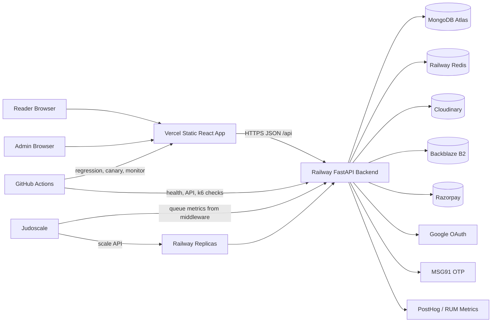
```mermaid
flowchart LR
  Reader[Reader Browser] --> FE[Vercel Static React App]
  Admin[Admin Browser] --> FE
  FE -->|HTTPS JSON /api| BE[Railway FastAPI Backend]

  BE --> Mongo[(MongoDB Atlas)]
  BE --> Redis[(Railway Redis)]
  BE --> Cloudinary[(Cloudinary)]
  BE --> B2[(Backblaze B2)]
  BE --> Razorpay[(Razorpay)]
  BE --> Google[Google OAuth]
  BE --> MSG91[MSG91 OTP]
  BE --> PostHog[PostHog / RUM Metrics]

  GHA[GitHub Actions] -->|regression, canary, monitor| FE
  GHA -->|health, API, k6 checks| BE

  Judoscale[Judoscale] -->|queue metrics from middleware| BE
  Judoscale -->|scale API| Railway[Railway Replicas]
  Railway --> BE
```

### HLD Responsibilities

| Layer | Responsibility |
| --- | --- |
| Vercel | Static frontend hosting, HTTPS, immutable asset caching, SPA rewrites, security headers. |
| React app | Public library UX, reader UX, account UX, admin dashboard, SEO metadata, API clients. |
| FastAPI app | Business rules, auth, reader gating, wallet accounting, payment verification, admin APIs. |
| MongoDB | Canonical persistence for books, chapters, users, wallets, payments, settings, and audit data. |
| Redis | Shared cache, shared rate-limit state, startup leader locks, replica-safe behavior. |
| Cloudinary | Cover/thumbnail/image upload, responsive image URLs, chapter embedded images, small audio fallback. |
| Backblaze B2 | S3-compatible storage for large audiobook MP3s, reached through backend byte-range proxying. |
| Razorpay | Payment order creation, payment verification, webhook events, wallet top-up crediting. |
| Judoscale | Horizontal autoscaling trigger based on backend queue time. |
| GitHub Actions | Regression gates, Railway deploy gate, post-deploy k6 smoke/load, scheduled production monitoring. |

## Low Level Design

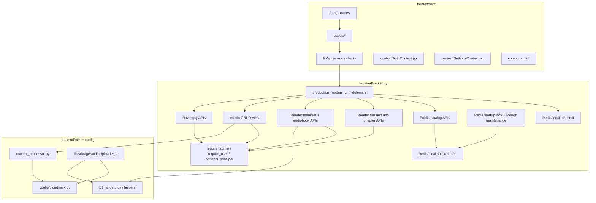
```mermaid
flowchart TB
  subgraph FE[frontend/src]
    App[App.js routes]
    APIClient[lib/api.js axios clients]
    AuthCtx[context/AuthContext.jsx]
    SettingsCtx[context/SettingsContext.jsx]
    Pages[pages/*]
    Components[components/*]
  end

  subgraph BE[backend/server.py]
    Middleware[production_hardening_middleware]
    Auth[require_admin / require_user / optional_principal]
    PublicAPI[Public catalog APIs]
    ReaderAPI[Reader session and chapter APIs]
    ManifestAPI[Reader manifest + audiobook APIs]
    AdminAPI[Admin CRUD APIs]
    PaymentAPI[Razorpay APIs]
    Startup[Redis startup lock + Mongo maintenance]
    Cache[Redis/local public cache]
    RateLimit[Redis/local rate limit]
  end

  subgraph Utils[backend/utils + config]
    Processor[content_processor.py]
    Cloud[config/cloudinary.py]
    AudioUpload[lib/storage/audioUploader.js]
    B2Proxy[B2 range proxy helpers]
  end

  App --> Pages
  Pages --> APIClient
  APIClient --> Middleware
  Middleware --> RateLimit
  Middleware --> PublicAPI
  Middleware --> ReaderAPI
  Middleware --> ManifestAPI
  Middleware --> AdminAPI
  Middleware --> PaymentAPI
  ReaderAPI --> Auth
  ManifestAPI --> Auth
  AdminAPI --> Auth
  PaymentAPI --> Auth
  PublicAPI --> Cache
  AdminAPI --> Processor
  Processor --> Cloud
  AudioUpload --> Cloud
  AudioUpload --> B2Proxy
  ManifestAPI --> B2Proxy
  Startup --> Cache
```

### Request Lifecycle

1. Browser loads static assets from Vercel.
2. React route renders a page and calls `frontend/src/lib/api.js`.
3. API request goes to `https://api.theearnalism.com/api/...`.
4. FastAPI middleware applies security headers, structured logging, rate limits, and graceful drain handling.
5. Auth dependencies validate JWTs and session state where needed.
6. Route handler reads/writes MongoDB and optionally Redis cache/locks.
7. Reader manifest and audiobook routes resolve metadata from MongoDB and stream B2 audio with byte-range headers when needed.
8. Response returns sanitized JSON with no Mongo `_id`.

## Runtime Architecture

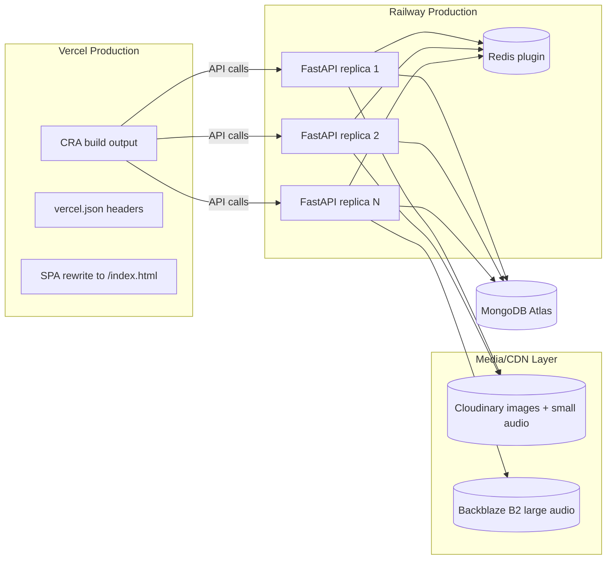
```mermaid
flowchart LR
  subgraph Vercel[Vercel Production]
    Static[CRA build output]
    Headers[vercel.json headers]
    Rewrite[SPA rewrite to /index.html]
  end

  subgraph Railway[Railway Production]
    R1[FastAPI replica 1]
    R2[FastAPI replica 2]
    RN[FastAPI replica N]
    Redis[(Redis plugin)]
  end

  subgraph Media[Media/CDN Layer]
    Cloudinary[(Cloudinary images + small audio)]
    B2[(Backblaze B2 large audio)]
  end

  Static -->|API calls| R1
  Static -->|API calls| R2
  Static -->|API calls| RN
  R1 --> Redis
  R2 --> Redis
  RN --> Redis
  R1 --> Mongo[(MongoDB Atlas)]
  R2 --> Mongo
  RN --> Mongo
  R1 --> Cloudinary
  R2 --> Cloudinary
  RN --> B2
```

Redis is intentionally not used for book-cover images or audiobook binaries. Images stay on Cloudinary/CDN/browser cache, and audiobook MP3s stay on Cloudinary or B2 with HTTP cache/range semantics. Redis is reserved for metadata, reader manifests, chapter payloads where safe, short-lived user/session/payment state, rate limits, and startup locks.

## Frontend Architecture

### Framework And Build

- Framework: React 19 with Create React App via CRACO.
- Router: `react-router-dom`.
- Icons: `lucide-react`.
- Notifications: `sonner`.
- Rich editor: TipTap for admin journal content.
- API transport: `axios`, with browser `fetch` for refresh/analytics/beacon paths.
- Styling: Tailwind + custom CSS variables in `frontend/src/index.css` and `App.css`.

### Frontend Routes

| Route | Page | Purpose |
| --- | --- | --- |
| `/` | `Home.jsx` | Landing page, shelves, featured books, newsletter capture. |
| `/library` | `Library.jsx` | Public catalog browsing and category filtering. |
| `/book/:slug` | `BookDetail.jsx` | Book metadata, table of contents, reader entry. |
| `/reader/:slug` | `Reader.jsx` | Full-screen reader, gated chapter access, wallet pulse billing. |
| `/journal` | `Journal.jsx` | Public journal list. |
| `/journal/:slug` | `JournalArticle.jsx` | Journal article detail. |
| `/pricing` | `Pricing.jsx` | Reading-time packs and Razorpay checkout. |
| `/login` | `Login.jsx` | Email, Google, and OTP user login. |
| `/signup` | `Signup.jsx` | Reader account creation. |
| `/account` | `Account.jsx` | Reader profile, wallet, transactions. |
| `/contact` | `Contact.jsx` | Contact form. |
| `/about` | `About.jsx` | About page. |
| `/admin/login` | `AdminLogin.jsx` | Admin login. |
| `/admin` | `Admin.jsx` | Admin dashboard for books, blog, categories, users, payments, settings. |

### Frontend State And API Clients

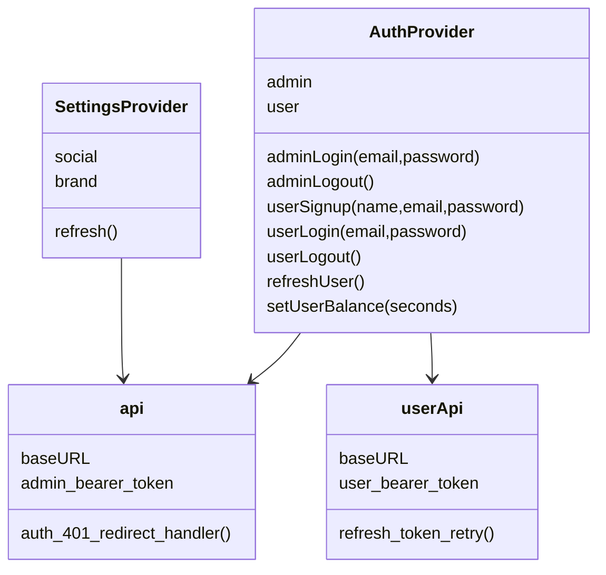
```mermaid
classDiagram
  class AuthProvider {
    admin
    user
    adminLogin(email,password)
    adminLogout()
    userSignup(name,email,password)
    userLogin(email,password)
    userLogout()
    refreshUser()
    setUserBalance(seconds)
  }

  class SettingsProvider {
    social
    brand
    refresh()
  }

  class api {
    baseURL
    admin_bearer_token
    auth_401_redirect_handler()
  }

  class userApi {
    baseURL
    user_bearer_token
    refresh_token_retry()
  }

  AuthProvider --> api
  AuthProvider --> userApi
  SettingsProvider --> api
```

Important token keys:

- Admin JWT: `earnalism_admin_token`.
- Reader JWT: `earnalism_user_token`.
- Reader refresh token: HTTP-only cookie set by backend.

## Backend Architecture

### Framework And Runtime

- Runtime: Python 3.11 container on Railway.
- Web framework: FastAPI + Uvicorn.
- Database driver: Motor / PyMongo.
- Data validation: Pydantic.
- Cache/rate limits/locks: Redis when `MULTI_REPLICA_ENABLED=true`.
- Middleware: CORS, gzip, structured errors, security headers, rate limiting, graceful drain.
- Autoscaling metrics: `judoscale[asgi]`.

### Backend Components

| Component | Location | Responsibility |
| --- | --- | --- |
| `server.py` | `backend/server.py` | FastAPI app, models, auth, routes, billing, payments, cache, startup. |
| `content_processor.py` | `backend/utils/content_processor.py` | DOCX/MD/HTML/TXT chapter conversion, sanitization, image extraction. |
| `cloudinary.py` | `backend/config/cloudinary.py` | Cloudinary initialization, upload, responsive URLs. |
| `audioUploader.js` | `lib/storage/audioUploader.js` | Node storage router for audiobook uploads: Cloudinary at or below 100 MB, Backblaze B2 multipart upload above 100 MB. |
| `production_monitor.mjs` | `scripts/production_monitor.mjs` | Scheduled/local production health, latency, reader manifest, and catalog observer. |
| `railway.json` | `backend/railway.json` | Railway build/start/health configuration. |
| `Dockerfile` | `backend/Dockerfile` | Container build and local Docker health check. |

### Backend Flowchart

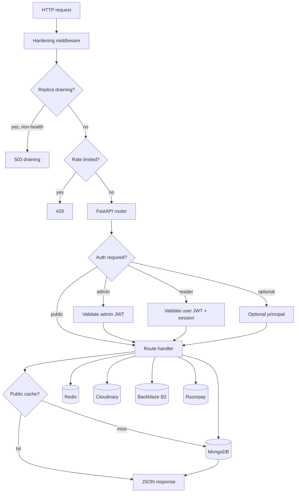
```mermaid
flowchart TD
  Request[HTTP request] --> Middleware[Hardening middleware]
  Middleware --> Draining{Replica draining?}
  Draining -->|yes, non-health| Drain503[503 draining]
  Draining -->|no| RateLimit{Rate limited?}
  RateLimit -->|yes| Rate429[429]
  RateLimit -->|no| Router[FastAPI router]
  Router --> Auth{Auth required?}
  Auth -->|admin| AdminJWT[Validate admin JWT]
  Auth -->|reader| UserJWT[Validate user JWT + session]
  Auth -->|optional| Optional[Optional principal]
  Auth -->|public| Handler[Route handler]
  AdminJWT --> Handler
  UserJWT --> Handler
  Optional --> Handler
  Handler --> Cache{Public cache?}
  Cache -->|hit| Response[JSON response]
  Cache -->|miss| Mongo[(MongoDB)]
  Handler --> Mongo
  Handler --> Redis[(Redis)]
  Handler --> Cloudinary[(Cloudinary)]
  Handler --> B2[(Backblaze B2)]
  Handler --> Razorpay[(Razorpay)]
  Mongo --> Response
```

## Data Model And ERD

MongoDB collections are document-oriented. The main model stores chapters embedded in book documents because reader table-of-contents and chapter metadata are naturally book-scoped.


```mermaid
erDiagram
  USERS ||--o{ USER_SESSIONS : owns
  USERS ||--o{ READING_SESSIONS : reads
  USERS ||--o{ WALLET_TRANSACTIONS : has
  USERS ||--o{ WALLET_LEDGER : has
  USERS ||--o{ TOPUP_INTENTS : creates
  USERS ||--o{ READER_COMPLETIONS : completes
  USERS ||--o{ REWARD_CLAIMS : claims
  USERS ||--o{ WALLET_REFUNDS : receives

  CATEGORIES ||--o{ BOOKS : shelves
  BOOKS ||--o{ CHAPTERS : embeds
  BOOKS ||--o{ READING_SESSIONS : referenced_by
  BOOKS ||--o{ READER_SECURITY_EVENTS : protects

  TOPUP_INTENTS ||--o{ PAYMENT_WEBHOOK_EVENTS : audited_by
  BLOG_POSTS ||--o{ SETTINGS : unrelated
  CONTACTS ||--o{ USERS : admin_views
  NEWSLETTER ||--o{ USERS : optional

  USERS {
    string id
    string email
    string role
    string status
    int reading_seconds_balance
    object active_reading_session
  }

  BOOKS {
    string id
    string slug
    string title
    string author
    string category_slug
    bool is_published
    array chapters
    object rights_metadata
  }

  CHAPTERS {
    string id
    string title
    string content
    int order
    bool is_preview
    string processing_status
  }

  TOPUP_INTENTS {
    string id
    string user_id
    string razorpay_order_id
    string status
    int minutes
    int amount_paise
  }

  WALLET_LEDGER {
    string id
    string user_id
    string action
    int seconds_delta
    int balance_after
  }
```

### Primary Collections

| Collection | Purpose |
| --- | --- |
| `users` | Admin and reader accounts, active session pointers, reading wallet balance. |
| `user_sessions` | Refresh-token backed reader sessions and trusted device state. |
| `books` | Book metadata, embedded chapters, cover fields, publication state, rights metadata. |
| `categories` | Canonical shelf taxonomy. |
| `blog_posts` | Journal posts. |
| `newsletter` | Reading Circle signups. |
| `contacts` | Contact form submissions and admin status. |
| `settings` | Featured book, social links, brand settings. |
| `reading_sessions` | Legacy/explicit reading sessions. |
| `wallet_transactions` | Reader-facing wallet transaction rows. |
| `wallet_ledger` | Canonical wallet accounting ledger. |
| `wallet_integrity_alerts` | Balance/ledger mismatch alerts. |
| `wallet_refunds` | Admin-approved refund findings and credits. |
| `topup_intents` | Razorpay order/intention records. |
| `payment_webhook_events` | Razorpay webhook audit log. |
| `analytics_events` | Funnel and performance analytics. |
| `reader_security_events` | Secure reader copy/print/context-menu/screenshot-key attempts. |
| `reader_completions` | Reader completion streak evidence. |
| `reward_claims` | Claimed reader rewards. |
| `credit_log` | Admin upload credit accounting. |
| `admin_upload_audit` | Admin upload audit artifacts, including GridFS refs in multi-replica mode. |
| `otp_store` | Temporary mobile OTP records. |

## Data Flow

### Public Catalog Data Flow

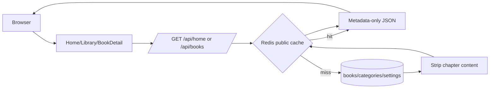
```mermaid
flowchart LR
  Browser --> Home[Home/Library/BookDetail]
  Home --> API[/GET /api/home or /api/books/]
  API --> Cache{Redis public cache}
  Cache -->|hit| JSON[Metadata-only JSON]
  Cache -->|miss| Mongo[(books/categories/settings)]
  Mongo --> Strip[Strip chapter content]
  Strip --> Cache
  Cache --> JSON
  JSON --> Browser
```

Public catalog endpoints intentionally remove chapter bodies. Full chapter content is fetched only through the gated reader endpoint.

### Reader Data Flow

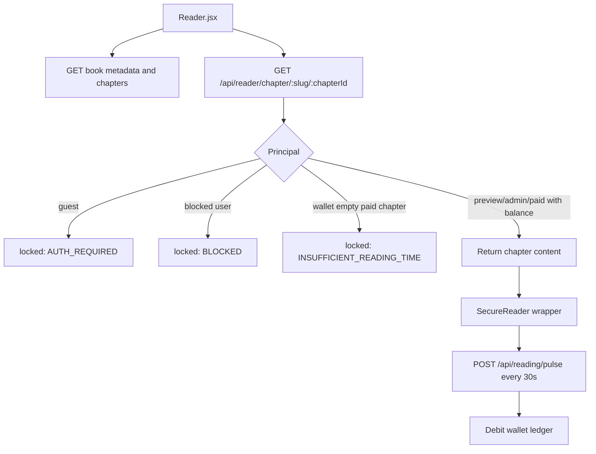
```mermaid
flowchart TD
  ReaderPage[Reader.jsx] --> BookMeta[GET book metadata and chapters]
  ReaderPage --> ChapterGate[GET /api/reader/chapter/:slug/:chapterId]
  ChapterGate --> AuthCheck{Principal}
  AuthCheck -->|guest| LockedAuth[locked: AUTH_REQUIRED]
  AuthCheck -->|blocked user| LockedBlocked[locked: BLOCKED]
  AuthCheck -->|wallet empty paid chapter| LockedWallet[locked: INSUFFICIENT_READING_TIME]
  AuthCheck -->|preview/admin/paid with balance| Content[Return chapter content]
  Content --> SecureReader[SecureReader wrapper]
  SecureReader --> Pulse[POST /api/reading/pulse every 30s]
  Pulse --> Wallet[Debit wallet ledger]
```

### Audiobook Data Flow

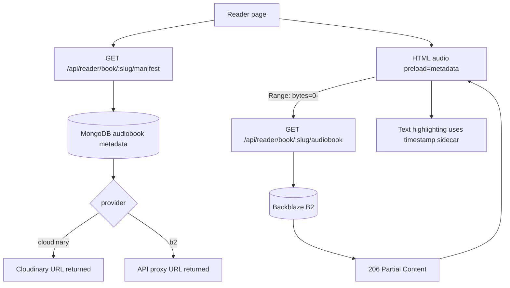
```mermaid
flowchart TD
  Reader[Reader page] --> Manifest[GET /api/reader/book/:slug/manifest]
  Manifest --> Mongo[(MongoDB audiobook metadata)]
  Mongo --> AudioDoc{provider}
  AudioDoc -->|cloudinary| CloudinaryURL[Cloudinary URL returned]
  AudioDoc -->|b2| ApiURL[API proxy URL returned]
  Reader --> AudioTag[HTML audio preload=metadata]
  AudioTag -->|Range: bytes=0-| PlaybackAPI[GET /api/reader/book/:slug/audiobook]
  PlaybackAPI --> B2[(Backblaze B2)]
  B2 --> Partial[206 Partial Content]
  Partial --> AudioTag
  AudioTag --> Highlight[Text highlighting uses timestamp sidecar]
```

Playback uses browser-native metadata preloading and byte-range requests so readers can start quickly, seek smoothly, and avoid downloading the whole audiobook upfront. The timestamp sidecar remains a separate lightweight asset so text highlighting can stay in sync with the audio timeline.

### Admin Publishing Data Flow

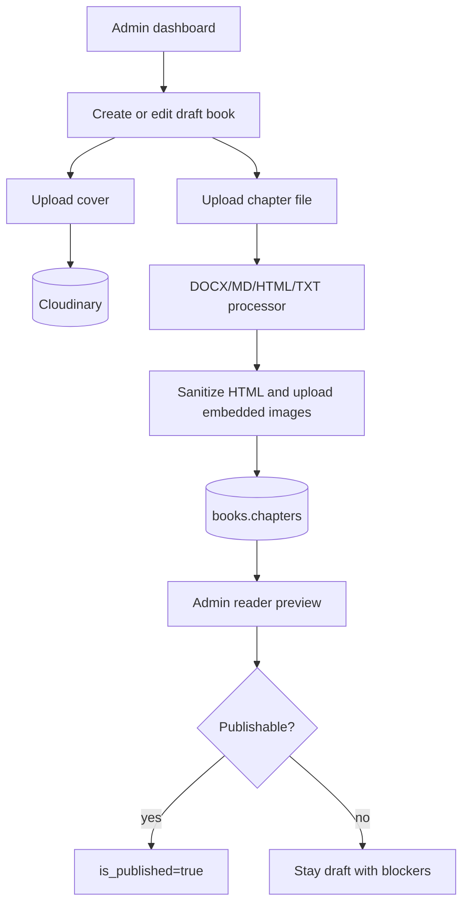
```mermaid
flowchart TD
  Admin[Admin dashboard] --> Draft[Create or edit draft book]
  Draft --> Cover[Upload cover]
  Cover --> Cloudinary[(Cloudinary)]
  Draft --> Chapter[Upload chapter file]
  Chapter --> Processor[DOCX/MD/HTML/TXT processor]
  Processor --> Sanitize[Sanitize HTML and upload embedded images]
  Sanitize --> Mongo[(books.chapters)]
  Mongo --> Preview[Admin reader preview]
  Preview --> PublishGate{Publishable?}
  PublishGate -->|yes| Published[is_published=true]
  PublishGate -->|no| DraftHold[Stay draft with blockers]
```

### Payment Data Flow

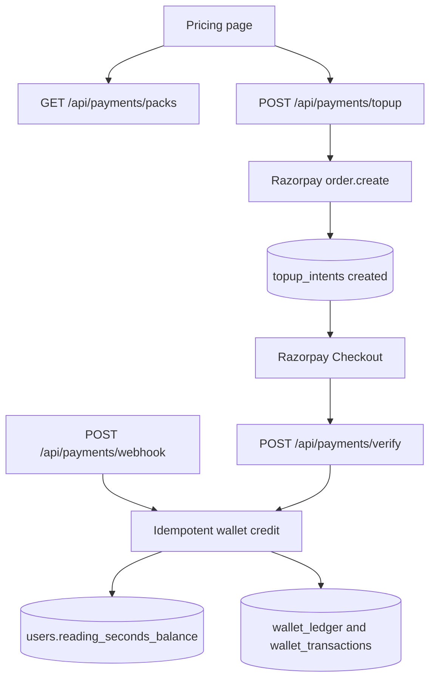
```mermaid
flowchart TD
  Pricing[Pricing page] --> Packs[GET /api/payments/packs]
  Pricing --> Topup[POST /api/payments/topup]
  Topup --> RazorpayOrder[Razorpay order.create]
  RazorpayOrder --> Intent[(topup_intents created)]
  Intent --> Checkout[Razorpay Checkout]
  Checkout --> Verify[POST /api/payments/verify]
  RazorpayWebhook[POST /api/payments/webhook] --> Credit
  Verify --> Credit[Idempotent wallet credit]
  Credit --> Users[(users.reading_seconds_balance)]
  Credit --> Ledger[(wallet_ledger and wallet_transactions)]
```

## API Surface

All backend API routes are under `/api` except root health aliases.

### Public

| Method | Route | Purpose |
| --- | --- | --- |
| `GET` | `/api/health` | DB-aware health payload. |
| `GET` | `/healthz`, `/api/healthz` | Lightweight Railway health check. |
| `GET` | `/api/home` | Combined cached home payload. |
| `GET` | `/api/categories` | Shelf list. |
| `GET` | `/api/books` | Published book list, metadata only. |
| `GET` | `/api/books/{slug}` | Published book detail, metadata and ToC only. |
| `GET` | `/api/books/{slug}/chapters` | Chapter metadata list. |
| `GET` | `/api/books/{slug}/chapters/{chapter_id}` | Preview chapter content only if free preview. |
| `GET` | `/api/blog` | Published journal posts. |
| `GET` | `/api/blog/{slug}` | Published journal detail. |
| `GET` | `/api/featured` | Featured book setting. |
| `POST` | `/api/newsletter` | Reading Circle signup. |
| `POST` | `/api/contact` | Contact form. |
| `GET` | `/api/settings/public` | Social + brand settings. |
| `GET` | `/api/payments/packs` | Reading-time packs. |
| `GET` | `/api/payments/config` | Razorpay public config status. |

### Reader Auth And Wallet

| Method | Route | Purpose |
| --- | --- | --- |
| `POST` | `/api/users/signup` | Email/password reader signup. |
| `POST` | `/api/users/login` | Reader login. |
| `POST` | `/api/users/logout` | Reader logout and refresh-cookie clearing. |
| `POST` | `/api/users/refresh` | Refresh reader access token. |
| `POST` | `/api/auth/google` | Google reader auth. |
| `POST` | `/api/auth/otp/request` | Request mobile OTP. |
| `POST` | `/api/auth/otp/verify` | Verify mobile OTP and login. |
| `GET` | `/api/users/me` | Reader profile. |
| `GET` | `/api/users/me/wallet` | Wallet balance. |
| `GET` | `/api/users/me/transactions` | Reader transaction history. |
| `GET` | `/api/users/me/rewards` | Completion reward state. |
| `POST` | `/api/users/me/rewards/completion` | Record chapter completion evidence. |
| `POST` | `/api/users/me/rewards/claim` | Claim streak reward. |

### Reader Sessions

| Method | Route | Purpose |
| --- | --- | --- |
| `GET` | `/api/reader/chapter/{slug}/{chapter_id}` | Gated chapter body endpoint. |
| `GET` | `/api/reader/book/{slug}/manifest` | Reader manifest with chapter metadata, audiobook metadata, asset URLs, and cache-safe reader payload. |
| `GET/HEAD` | `/api/reader/book/{slug}/audiobook` | Audiobook MP3 playback endpoint; proxies B2 assets with byte-range support when provider is `b2`. |
| `GET/HEAD` | `/api/reader/book/{slug}/audiobook/{asset_key}` | Audiobook sidecar asset endpoint, including timestamps. |
| `POST` | `/api/reading/session/start` | Start active reading session. |
| `POST` | `/api/reading/pulse` | 30-second reader billing pulse. |
| `POST` | `/api/reading/session/end` | End active reading session. |
| `GET` | `/api/reading/packs` | Simplified pack list for reader UX. |
| `POST` | `/api/reader/metrics` | Reader RUM/performance event aggregation. |

Legacy aliases also exist under `/api/reader/session/start`, `/api/reader/heartbeat`, and `/api/reader/session/end`.

### Payments

| Method | Route | Purpose |
| --- | --- | --- |
| `POST` | `/api/payments/topup` | Create Razorpay top-up order. |
| `POST` | `/api/payments/verify` | Verify checkout signature and credit wallet. |
| `POST` | `/api/payments/webhook` | Razorpay webhook and audit handler. |
| `GET` | `/api/payments/me/intents` | Reader top-up intent history. |
| `POST` | `/api/payments/_simulate_topup` | Test-mode top-up simulation. |
| `POST` | `/api/payments/_simulate_webhook` | Test-mode webhook simulation. |

### Admin

| Method | Route | Purpose |
| --- | --- | --- |
| `POST` | `/api/auth/login` | Admin login. |
| `GET` | `/api/auth/me` | Admin profile. |
| `POST` | `/api/auth/change-password` | Admin password change. |
| `GET/POST/PUT/DELETE` | `/api/admin/books...` | Book CRUD, summary, detail. |
| `POST` | `/api/upload_docx` | Admin DOCX/template validator. |
| `POST` | `/api/admin/books/import-template` | Admin book template upload. |
| `GET` | `/api/credits/report` | Upload credit report. |
| `POST/PUT/DELETE` | `/api/admin/books/{slug}/chapters...` | Chapter CRUD and reorder. |
| `POST` | `/api/admin/books/{slug}/cover` | Cover upload. |
| `POST` | `/api/admin/books/{slug}/chapters/{chapter_id}/upload` | Chapter file upload. |
| `POST` | `/api/admin/upload/image` | Journal image upload. |
| `POST/PUT/DELETE` | `/api/admin/categories...` | Category management. |
| `GET/POST/PUT/DELETE` | `/api/admin/blog...` | Journal management. |
| `GET` | `/api/admin/newsletter` | Newsletter rows. |
| `GET/PATCH` | `/api/admin/contacts...` | Contact inbox and status. |
| `PUT` | `/api/admin/settings/social` | Social links. |
| `PUT` | `/api/admin/settings/brand` | Brand logo and OG image. |
| `POST` | `/api/admin/settings/brand/logo` | Authenticated Canva-exported PNG/WebP logo upload; stage, preview, then save with the brand settings route. |
| `PUT` | `/api/admin/featured` | Featured book setting. |
| `GET/PATCH` | `/api/admin/users...` | Reader list and status. |
| `POST` | `/api/admin/users/{uid}/wallet/adjust` | Manual wallet adjustment. |
| `GET` | `/api/admin/users/{uid}/wallet/refund-review` | Billing discrepancy scanner. |
| `POST` | `/api/admin/users/{uid}/wallet/refund-approve` | Approve selected refund candidates. |
| `GET` | `/api/admin/payments/intents` | Payment intent dashboard. |
| `GET` | `/api/admin/payments/webhooks` | Webhook audit dashboard. |
| `POST` | `/api/admin/payments/intents/{intent_id}/reconcile` | Manual payment reconcile. |
| `GET` | `/api/admin/secure-reader/alerts` | Reader protection alerts. |
| `GET` | `/api/admin/cache/status` | Redis/local cache status, memory policy visibility, and cache guidance. |
| `PATCH` | `/api/admin/books/{slug}/audiobook` | Updates audiobook flags, provider, asset URLs, size, and duration after onboarding. |

## API Sequence Diagrams

### Public Browse And Preview

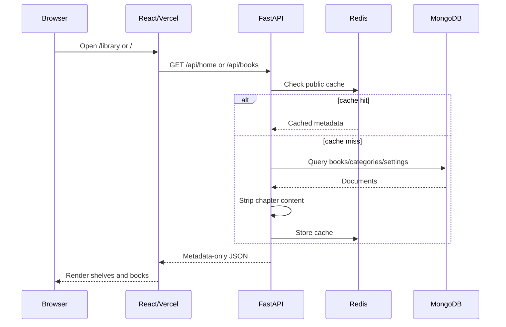
```mermaid
sequenceDiagram
  participant B as Browser
  participant FE as React/Vercel
  participant API as FastAPI
  participant R as Redis
  participant M as MongoDB

  B->>FE: Open /library or /
  FE->>API: GET /api/home or /api/books
  API->>R: Check public cache
  alt cache hit
    R-->>API: Cached metadata
  else cache miss
    API->>M: Query books/categories/settings
    M-->>API: Documents
    API->>API: Strip chapter content
    API->>R: Store cache
  end
  API-->>FE: Metadata-only JSON
  FE-->>B: Render shelves and books
```

### Reader Login And Token Refresh

```mermaid
sequenceDiagram
  participant B as Browser
  participant FE as AuthProvider
  participant API as FastAPI
  participant M as MongoDB

  B->>FE: Submit login
  FE->>API: POST /api/users/login
  API->>M: Verify user and password
  API->>M: Create user_session
  API-->>FE: Access JWT + user; set refresh cookie
  FE->>FE: Save access JWT in localStorage
  FE->>API: GET /api/users/me
  API-->>FE: Reader profile

  Note over FE,API: On later 401
  FE->>API: POST /api/users/refresh with cookie
  API->>M: Rotate/validate refresh session
  API-->>FE: New access JWT
```

### Gated Reader Chapter

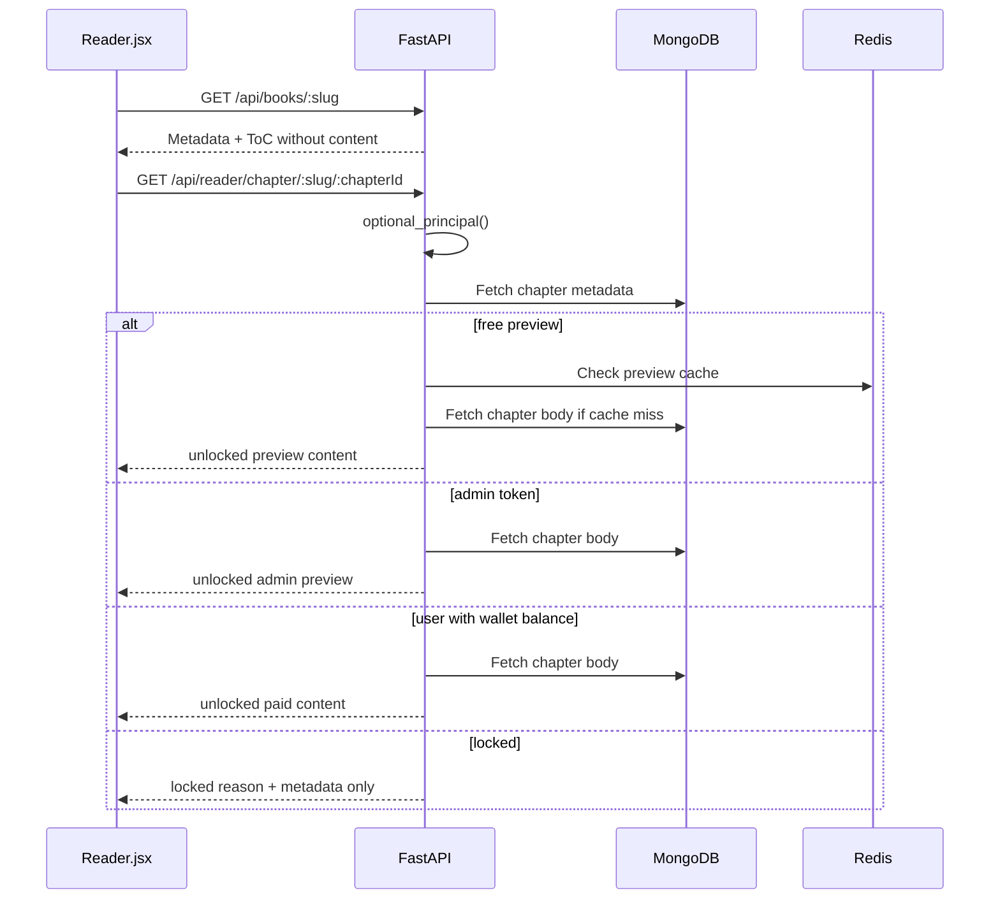
```mermaid
sequenceDiagram
  participant FE as Reader.jsx
  participant API as FastAPI
  participant M as MongoDB
  participant R as Redis

  FE->>API: GET /api/books/:slug
  API-->>FE: Metadata + ToC without content
  FE->>API: GET /api/reader/chapter/:slug/:chapterId
  API->>API: optional_principal()
  API->>M: Fetch chapter metadata
  alt free preview
    API->>R: Check preview cache
    API->>M: Fetch chapter body if cache miss
    API-->>FE: unlocked preview content
  else admin token
    API->>M: Fetch chapter body
    API-->>FE: unlocked admin preview
  else user with wallet balance
    API->>M: Fetch chapter body
    API-->>FE: unlocked paid content
  else locked
    API-->>FE: locked reason + metadata only
  end
```

### Reading Pulse Billing

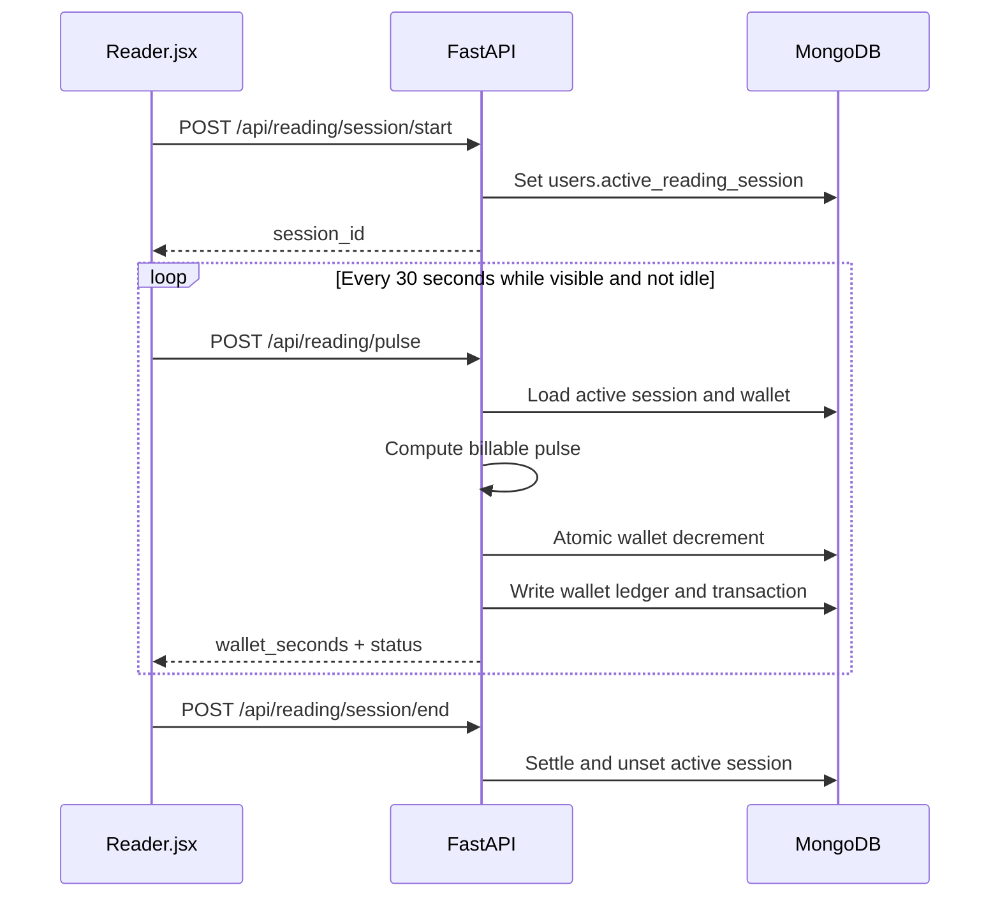
```mermaid
sequenceDiagram
  participant FE as Reader.jsx
  participant API as FastAPI
  participant M as MongoDB

  FE->>API: POST /api/reading/session/start
  API->>M: Set users.active_reading_session
  API-->>FE: session_id

  loop Every 30 seconds while visible and not idle
    FE->>API: POST /api/reading/pulse
    API->>M: Load active session and wallet
    API->>API: Compute billable pulse
    API->>M: Atomic wallet decrement
    API->>M: Write wallet ledger and transaction
    API-->>FE: wallet_seconds + status
  end

  FE->>API: POST /api/reading/session/end
  API->>M: Settle and unset active session
```

### Razorpay Top-Up

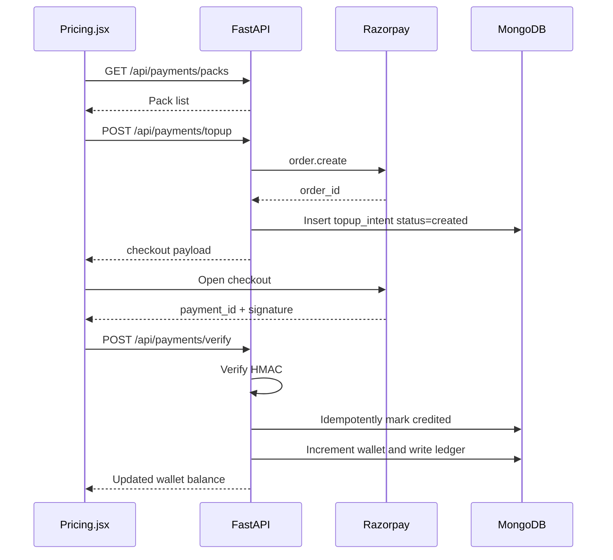
```mermaid
sequenceDiagram
  participant FE as Pricing.jsx
  participant API as FastAPI
  participant RP as Razorpay
  participant M as MongoDB

  FE->>API: GET /api/payments/packs
  API-->>FE: Pack list
  FE->>API: POST /api/payments/topup
  API->>RP: order.create
  RP-->>API: order_id
  API->>M: Insert topup_intent status=created
  API-->>FE: checkout payload
  FE->>RP: Open checkout
  RP-->>FE: payment_id + signature
  FE->>API: POST /api/payments/verify
  API->>API: Verify HMAC
  API->>M: Idempotently mark credited
  API->>M: Increment wallet and write ledger
  API-->>FE: Updated wallet balance
```

### Admin Book Upload

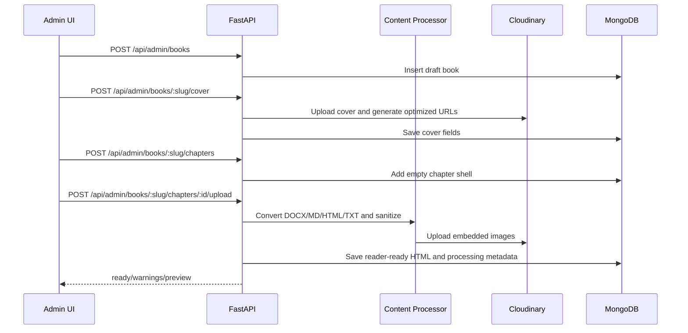
```mermaid
sequenceDiagram
  participant A as Admin UI
  participant API as FastAPI
  participant CP as Content Processor
  participant C as Cloudinary
  participant M as MongoDB

  A->>API: POST /api/admin/books
  API->>M: Insert draft book
  A->>API: POST /api/admin/books/:slug/cover
  API->>C: Upload cover and generate optimized URLs
  API->>M: Save cover fields
  A->>API: POST /api/admin/books/:slug/chapters
  API->>M: Add empty chapter shell
  A->>API: POST /api/admin/books/:slug/chapters/:id/upload
  API->>CP: Convert DOCX/MD/HTML/TXT and sanitize
  CP->>C: Upload embedded images
  API->>M: Save reader-ready HTML and processing metadata
  API-->>A: ready/warnings/preview
```

### Audiobook Upload Routing

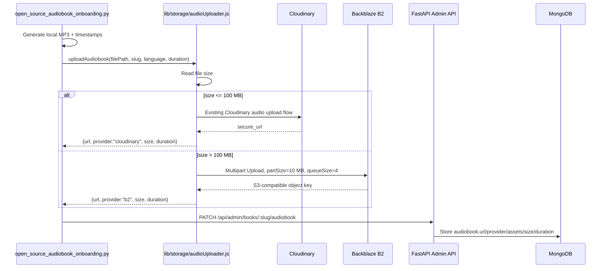
```mermaid
sequenceDiagram
  participant S as open_source_audiobook_onboarding.py
  participant U as lib/storage/audioUploader.js
  participant C as Cloudinary
  participant B2 as Backblaze B2
  participant API as FastAPI Admin API
  participant M as MongoDB

  S->>S: Generate local MP3 + timestamps
  S->>U: uploadAudiobook(filePath, slug, language, duration)
  U->>U: Read file size
  alt size <= 100 MB
    U->>C: Existing Cloudinary audio upload flow
    C-->>U: secure_url
    U-->>S: {url, provider:"cloudinary", size, duration}
  else size > 100 MB
    U->>B2: Multipart Upload, partSize=10 MB, queueSize=4
    B2-->>U: S3-compatible object key
    U-->>S: {url, provider:"b2", size, duration}
  end
  S->>API: PATCH /api/admin/books/:slug/audiobook
  API->>M: Store audiobook.url/provider/assets/size/duration
```

### Audiobook Playback And Seeking

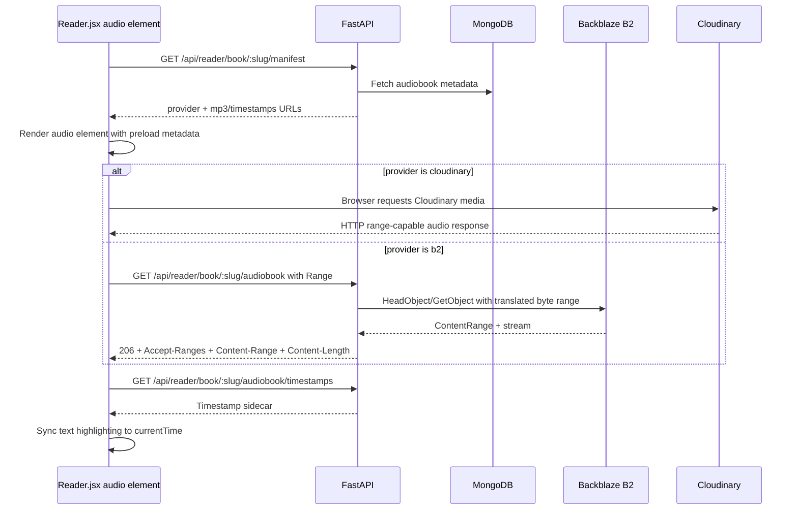
```mermaid
sequenceDiagram
  participant FE as Reader.jsx audio element
  participant API as FastAPI
  participant M as MongoDB
  participant B2 as Backblaze B2
  participant C as Cloudinary

  FE->>API: GET /api/reader/book/:slug/manifest
  API->>M: Fetch audiobook metadata
  API-->>FE: provider + mp3/timestamps URLs
  FE->>FE: Render audio element with preload metadata
  alt provider is cloudinary
    FE->>C: Browser requests Cloudinary media
    C-->>FE: HTTP range-capable audio response
  else provider is b2
    FE->>API: GET /api/reader/book/:slug/audiobook with Range
    API->>B2: HeadObject/GetObject with translated byte range
    B2-->>API: ContentRange + stream
    API-->>FE: 206 + Accept-Ranges + Content-Range + Content-Length
  end
  FE->>API: GET /api/reader/book/:slug/audiobook/timestamps
  API-->>FE: Timestamp sidecar
  FE->>FE: Sync text highlighting to currentTime
```

### CI/CD And Production Monitoring

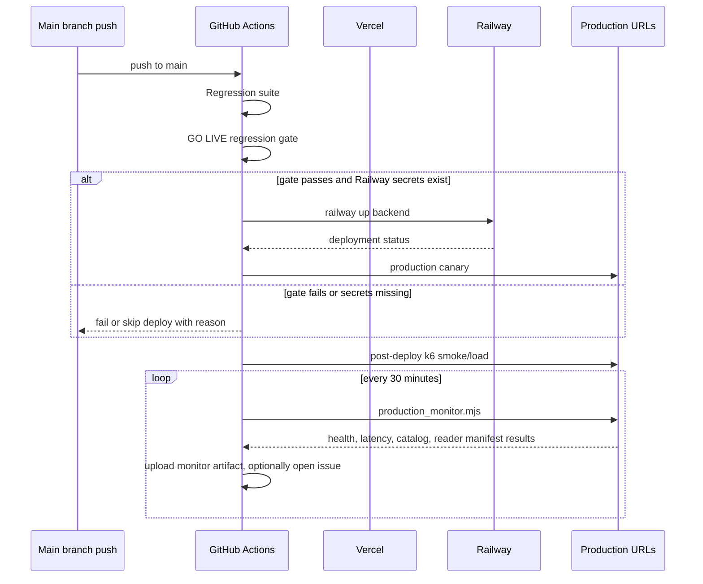
```mermaid
sequenceDiagram
  participant Dev as Main branch push
  participant GH as GitHub Actions
  participant V as Vercel
  participant R as Railway
  participant P as Production URLs

  Dev->>GH: push to main
  GH->>GH: Regression suite
  GH->>GH: GO LIVE regression gate
  alt gate passes and Railway secrets exist
    GH->>R: railway up backend
    R-->>GH: deployment status
    GH->>P: production canary
  else gate fails or secrets missing
    GH-->>Dev: fail or skip deploy with reason
  end
  GH->>P: post-deploy k6 smoke/load
  loop every 30 minutes
    GH->>P: production_monitor.mjs
    P-->>GH: health, latency, catalog, reader manifest results
    GH->>GH: upload monitor artifact, optionally open issue
  end
```

## Classes And Modules

### Backend Pydantic Models

| Class | Purpose |
| --- | --- |
| `LoginIn`, `ChangePasswordIn`, `TokenOut` | Admin auth input/output. |
| `Category`, `CategoryIn` | Shelf taxonomy. |
| `Chapter`, `ChapterIn`, `ChapterReorderIn` | Embedded book chapter model and admin chapter inputs. |
| `Book`, `BookIn` | Book metadata, publication state, covers, rights metadata, and embedded chapters. |
| `BlogPost`, `BlogPostIn` | Journal post model. |
| `NewsletterIn`, `ContactIn` | Public form inputs. |
| `SocialIn`, `BrandIn`, `FeaturedIn` | Site settings. |
| `UserSignupIn`, `UserLoginIn`, `UserOut`, `UserAuthOut` | Reader user auth and profile. |
| `GoogleAuthIn`, `OTPRequestIn`, `OTPVerifyIn` | Social/mobile auth inputs. |
| `WalletAdjustIn`, `WalletRefundApproveIn`, `WalletTransactionOut` | Wallet admin and transaction models. |
| `ReaderSessionStartIn`, `ReaderHeartbeatIn`, `ReaderSessionEndIn`, `ReadingPulseIn` | Reader session and pulse billing inputs. |
| `ReaderCompletionIn` | Reader reward completion evidence. |
| `AnalyticsEventIn`, `SecureReaderEventIn` | Funnel/performance/security event capture. |
| `UserStatusIn` | Admin block/unblock input. |
| `PackOut`, `TopUpCreateIn`, `TopUpCreateOut`, `PaymentVerifyIn`, `PaymentReconcileIn` | Payment pack, top-up, verification, and admin reconcile models. |

### Frontend Components And Modules

| Module | Purpose |
| --- | --- |
| `App.js` | Route tree, lazy route loading, high-intent route prefetch. |
| `AuthContext.jsx` | Admin and reader auth state, local token storage, logout, refresh helpers. |
| `SettingsContext.jsx` | Public social/brand settings. |
| `lib/api.js` | API base URL, axios clients, token injection, refresh retry, 401 redirects. |
| `Home.jsx`, `Library.jsx`, `BookDetail.jsx` | Public discovery and metadata pages. |
| `Reader.jsx` | Secure reader UI, chapter gating, text-to-speech, wallet pulse handling, reading rewards. |
| `SecureReader.jsx` | Client-side reader protection event capture. |
| `Pricing.jsx` | Pack list, Razorpay checkout, test-mode simulator path. |
| `Account.jsx` | Reader account and wallet history. |
| `Admin.jsx` | Admin dashboard tabs for content, users, payments, security, settings. |
| `ChapterUpload.jsx`, `CoverUpload.jsx`, `JournalEditor.jsx` | Admin upload/editor components. |
| `funnelAnalytics.js`, `performanceMetrics.js` | Analytics event capture. |
| `images.js` | Image normalization and optimized URL helpers. |

### Storage And Monitoring Modules

```mermaid
classDiagram
  class AudioUploader {
    +uploadAudiobookAsset(filePath, options)
    +uploadToCloudinary(filePath, options)
    +uploadToB2(filePath, options)
    +normalizeResult(url, provider, size, duration)
  }

  class OpenSourceAudiobookOnboarding {
    +generate(book)
    +validate(bundle)
    +upload_audiobook_asset(bundle)
    +sync_audiobook_flags(result)
  }

  class ReaderAudioAPI {
    +reader_book_audiobook(slug, request)
    +reader_book_audiobook_sidecar(slug, asset_key, request)
    +parse_b2_key(url)
    +stream_range_response(range)
  }

  class ProductionMonitor {
    +runCheck(name, url, budget)
    +extractBooks(payload)
    +writeReport()
    +failOnRequiredFailures()
  }

  OpenSourceAudiobookOnboarding --> AudioUploader
  OpenSourceAudiobookOnboarding --> ReaderAudioAPI : patches metadata
  ReaderAudioAPI --> AudioUploader : consumes provider/url shape
  ProductionMonitor --> ReaderAudioAPI : probes manifest/audio readiness
```

## Book Import And Publishing Pipeline

The repo includes admin UI upload and command-line bulk upload.

Always follow `AGENTS.md` for imports:

- Read `book_import_manifest.json` unless another manifest is provided.
- Download only legally cleared sources.
- Strip repository/license/source boilerplate from reader-facing content.
- Validate commercial-use rights before upload.
- Upload only passing books.
- Use draft mode by default.
- Keep source URLs and rights evidence internal/admin-only.
- Print uploaded IDs/slugs and skipped-book reasons.

Pipeline docs:

- `docs/NEW_BOOK_UPLOAD_GUIDE.md`
- `docs/BULK_PUBLISHING_PIPELINE.md`
- `scripts/import_books.py`
- `scripts/bulk_publishing_pipeline.py`
- `scripts/book_production_workflow.py`
- `scripts/earnalism_go_live.sh`

Audiobook onboarding uses `scripts/open_source_audiobook_onboarding.py` and the storage router in `lib/storage/audioUploader.js`. The router keeps existing Cloudinary behavior for audiobook files at or below 100 MB and sends larger MP3s to Backblaze B2 with multipart S3-compatible upload.

Run only the seven Cloudinary-blocked large audiobooks:

```bash
railway run npm run audiobook:b2:blocked -- --env-file .secrets/earnalism-import.env
```

Run only Pride and Prejudice if it is the remaining blocked title:

```bash
railway run .venv-audio/bin/python scripts/open_source_audiobook_onboarding.py generate \
  --local-only \
  --no-include-drafts \
  --include-published \
  --no-skip-live-audio-assets \
  --upload-to-storage \
  --sync-flags \
  --book pride-and-prejudice \
  --env-file .secrets/earnalism-import.env
```

Expected audiobook persistence shape:

```json
{
  "audiobook": {
    "url": "https://...",
    "provider": "cloudinary|b2",
    "size": 123456789,
    "duration_ms": 3600000
  },
  "audiobook_assets": {
    "mp3": "https://...",
    "timestamps": "https://..."
  }
}
```

Canonical category slugs:

- `bengali-classics`
- `literary-fiction`
- `young-readers`
- `business`
- `technology`
- `history-strategy`
- `adventure`
- `science-fiction`
- `gothic-fiction`

## Security Model

### Authentication

- Admins use `/api/auth/login` and an admin JWT.
- Readers use email/password, Google OAuth, or mobile OTP.
- Reader access JWT is stored in localStorage.
- Reader refresh token is stored as an HTTP-only cookie.
- Reader sessions are single-active-session oriented; a newer login can invalidate older active sessions.

### Authorization

- `require_admin` gates admin APIs.
- `require_user` gates reader account, wallet, session, and payment APIs.
- `optional_principal` supports public/guest reader paths while unlocking admin/user paths when a valid token is present.

### Reader Content Protection

- Public book detail endpoints never return paid chapter bodies.
- `/api/reader/chapter/{slug}/{chapter_id}` is the only full-content reader endpoint.
- Secure reader events are captured for blocked copy, print, context-menu, drag, and screenshot-key attempts.
- Admins can review protection alerts in `/admin` -> `security`.

### HTTP And Platform Hardening

- Vercel security headers are configured in `frontend/vercel.json`.
- Backend adds structured error responses and security headers.
- Rate limits are bucketed by auth/payment/upload/public/reader/webhook path groups.
- In multi-replica mode, rate-limit counters are Redis-backed.
- Railway `/healthz` stays lightweight and uncached.

## Performance And Autoscaling

### Frontend

- Static CRA build on Vercel.
- Immutable caching for `/static/*`.
- Browser/CDN caching for cover images, thumbnails, static assets, and Cloudinary variants.
- Audiobook elements use metadata preload so page render is not blocked by full audio downloads.
- SPA fallback rewrite to `/index.html`.
- Lazy page imports and idle-time prefetch for high-intent routes.

### Backend

- `/api/home` reduces landing-page fanout by bundling categories, books, and featured book.
- Public catalog endpoints are Redis-cacheable.
- Reader manifests and chapter payloads are cache candidates when they are metadata-safe and do not leak paid content.
- Audiobook playback supports byte-range streaming for B2 assets with `Accept-Ranges`, `Content-Range`, `Content-Length`, and `206 Partial Content`.
- Public catalog responses strip chapter bodies.
- MongoDB projections avoid shipping full embedded chapters unless required.
- Mongo pool defaults are tuned for multi-replica mode:
  - `MONGODB_MAX_POOL_SIZE=25`
  - `MONGODB_MIN_POOL_SIZE=1`
  - `MONGODB_MAX_CONNECTING=2`
  - `MONGODB_SERVER_SELECTION_TIMEOUT_MS=15000`
  - `MONGODB_WAIT_QUEUE_TIMEOUT_MS=5000`

### Redis Policy

- Use Redis for public metadata, reader manifests, safe chapter payloads, short-lived session/payment state, rate limits, and startup locks.
- Do not use Redis for book-cover images, thumbnails, audiobook MP3s, timestamp binaries, or other large media.
- Production eviction target: `REDIS_MAXMEMORY_POLICY=volatile-lfu`, with finite TTLs on cache keys.
- `REDIS_CONFIGURE_ON_STARTUP=false` is safer when Railway/Redis config is managed outside the app.
- Monitor `/api/admin/cache/status` for effective maxmemory, policy, hit/miss rate, eviction behavior, and oversized-key warnings.

### Railway Autoscaling

See `RAILWAY_SCALING_SETUP.md`.

Current design:

- Railway Pro backend service.
- `MULTI_REPLICA_ENABLED=true`.
- Redis provisioned through Railway.
- Judoscale ASGI middleware enabled by `JUDOSCALE_URL`.
- Judoscale range: min 2, max 10.
- Scale-up quantity: 2 replicas.
- Scale-up sensitivity: 10 seconds.
- Downscale interval: 300 seconds.
- Startup maintenance guarded by Redis leader lock.
- Graceful SIGTERM drain window: 15 seconds.

## Deployment

Production deployment has two paths:

- Main branch automation: pushes to `main` run regression gates, optional backend Railway CLI deployment, frontend Vercel production deployment, production canary, and post-deploy k6 smoke/load tests when the required deploy secrets exist.
- Manual operator path: `scripts/commit_push_deploy.sh` commits, pushes, deploys Railway backend, deploys Vercel frontend, and runs smoke checks from the terminal.

The GitHub GO LIVE workflow runs after the regression gate passes. Backend deploys through Railway CLI when `RAILWAY_TOKEN` and `RAILWAY_SERVICE_ID` exist; if Railway is already auto-deploying from Git, that job exits successfully without blocking the frontend. Frontend deploys through Vercel CLI from the `frontend/` project, and canary runs after a successful Vercel production deploy.

### Frontend: Vercel

Project root: `frontend/`.

Local build:

```bash
cd frontend
npm run build
```

Production deploy:

```bash
cd frontend
npx --yes vercel@latest deploy --prod --yes --force
```

Verify:

```bash
curl -I https://theearnalism.com
curl -s https://theearnalism.com/asset-manifest.json | head
```

The deployed Vercel project is linked by `frontend/.vercel/project.json`.
In GitHub Actions, the workflow links the same project at the repository checkout root and relies on the Vercel project setting `Root Directory = frontend`; run local manual Vercel commands from `frontend/`, but keep the gated CI prebuild path rooted at the repository checkout.

Required GitHub Actions secrets for gated frontend deploy:

- `VERCEL_TOKEN`: Vercel token with access to the `earnalism` project.
- `VERCEL_ORG_ID`: Vercel org/team ID from `frontend/.vercel/project.json`.
- `VERCEL_PROJECT_ID`: Vercel project ID from `frontend/.vercel/project.json`.
- `VERCEL_SCOPE`: optional, only needed if the token must target a specific Vercel team/user scope.

One-time external Git provider setup:

```bash
cd frontend
npx --yes vercel@latest git connect https://github.com/ronik18/earnalism-digital-library.git
```

If Vercel returns `You need to add a Login Connection to your GitHub account first`, add the GitHub Login Connection in Vercel account settings, then rerun the command. The Actions deploy path above does not bypass the GO-LIVE gate and is the production-safe automation path.

### Backend: Railway

Project root for deployment: `backend/`.

Health:

```bash
curl https://api.theearnalism.com/healthz
curl https://api.theearnalism.com/api/healthz
```

Deploy from local source:

```bash
railway up ./backend --path-as-root --service earnalism --environment production --detach
```

Check status:

```bash
railway deployment list --service earnalism --environment production --limit 5 --json
railway metrics --service earnalism --environment production --json
```

Manual one-shot deploy helper:

```bash
bash scripts/commit_push_deploy.sh
```

## Local Development

### Backend

```bash
cd backend
python3 -m venv .venv
source .venv/bin/activate
pip install -r requirements.txt
cp .env.example .env
uvicorn server:app --host 0.0.0.0 --port 8000 --reload
```

Minimum backend variables:

- `MONGODB_URL`
- `DB_NAME`
- `JWT_SECRET`
- `ADMIN_EMAIL`
- `ADMIN_PASSWORD`
- `FRONTEND_URL`
- `CORS_ORIGINS`

Optional integrations:

- `CLOUDINARY_CLOUD_NAME`, `CLOUDINARY_API_KEY`, `CLOUDINARY_API_SECRET`
- `RAZORPAY_KEY_ID`, `RAZORPAY_KEY_SECRET`, `RAZORPAY_WEBHOOK_SECRET`
- `GOOGLE_CLIENT_ID`, `GOOGLE_CLIENT_SECRET`
- `MSG91_AUTH_KEY`, `MSG91_TEMPLATE_ID`
- `REDIS_URL`, `MULTI_REPLICA_ENABLED`
- `JUDOSCALE_URL`

### Frontend

```bash
cd frontend
npm install --legacy-peer-deps
REACT_APP_BACKEND_URL=http://localhost:8000 npm start
```

For production API during local frontend development:

```bash
REACT_APP_BACKEND_URL=https://api.theearnalism.com npm start
```

## Testing And Regression

Root scripts:

```bash
npm run regression
npm run regression:go-live
npm run regression:canary
npm run monitor:production
npm run loadtest
npm run load:100
npm run load:10x
```

Focused backend tests:

```bash
python3 -m pytest \
  backend/tests/test_content_processor_safety.py \
  backend/tests/test_bengali_content_pipeline.py \
  backend/tests/test_reader_billing_policy.py
```

Frontend build:

```bash
cd frontend
npm run build
```

Scale docs:

- `docs/REGRESSION_AND_SCALE.md`
- `RAILWAY_SCALING_SETUP.md`

GitHub Actions gates:

- `.github/workflows/regression-suite.yml`: backend, frontend, and browser regression on PR/push.
- `.github/workflows/regression.yml`: PR regression; push GO LIVE gate; Railway deploy; Vercel frontend deploy; production canary.
- `.github/workflows/post-deploy-k6.yml`: post-deploy smoke and 100-user load test.
- `.github/workflows/production-monitor.yml`: scheduled production health/latency/catalog/reader-manifest observer every 30 minutes.

## Operations Runbook

### FE Go-Live

1. Ensure git is clean or intended changes are committed.
2. Run `cd frontend && npm run build`.
3. Run `npx --yes vercel@latest deploy --prod --yes --force`.
4. Confirm alias to `https://theearnalism.com`.
5. Smoke check home and `asset-manifest.json`.

### BE Go-Live

1. Run focused tests.
2. Deploy backend with Railway CLI.
3. Confirm `/healthz` and `/api/healthz`.
4. Check Railway deployment status and metrics.
5. Watch logs for Mongo, Redis, or payment errors.

### Emergency Backend Scale Override

```bash
railway scale --service earnalism --environment production us-west=8
```

After the spike:

```bash
railway scale --service earnalism --environment production us-west=0
```

Judoscale should normally handle this automatically.

### Payment Reconcile

1. Open `/admin`.
2. Go to `payments`.
3. Review top-up intents and webhook events.
4. Use admin reconcile only when payment evidence is valid and the webhook did not credit.

### Billing Refund Review

See `docs/WALLET_REFUND_PIPELINE.md`.

### Continuous Monitoring

1. Scheduled GitHub Actions runs `scripts/production_monitor.mjs` every 30 minutes.
2. The monitor checks frontend HTML, asset manifest, sitemap, API health, home payload, catalog, public settings, and a reader manifest for the first published book.
3. When `RAILWAY_TOKEN` and `RAILWAY_SERVICE_ID` are available, the workflow also captures Railway resource metrics, HTTP metrics, recent app logs, and recent HTTP errors.
4. Reports are uploaded as `production-monitor-report` artifacts.
5. Required failures fail the workflow and can notify maintainers through GitHub notifications.
6. Set repository variable `MONITOR_CREATE_ISSUE=true` to open a GitHub issue automatically on monitor failure.
7. Set `MONITOR_FAIL_ON_SLOW=true` only when the latency budgets are stable enough to fail scheduled runs on slow responses.

Local production monitor:

```bash
npm run monitor:production
```

Optional overrides:

```bash
FRONTEND_URL=https://theearnalism.com \
API_URL=https://api.theearnalism.com \
MONITOR_FAIL_ON_SLOW=true \
npm run monitor:production
```

### Optimization Loop

The safe optimization loop is observe, alert, diagnose, patch, regress, deploy, canary. Automation may collect metrics, upload reports, fail workflows, open issues, and deploy already-reviewed code through green CI gates. It must not silently publish books, modify payment state, change Redis eviction/memory settings, rewrite production data, or alter secrets without an explicit operator action.

## Technologies Used

| Area | Technology |
| --- | --- |
| Frontend | React 19, Create React App, CRACO, React Router, Tailwind CSS, custom CSS variables, lucide-react, sonner, TipTap. |
| Backend | Python 3.11, FastAPI, Uvicorn, Pydantic, Motor/PyMongo, ASGI middleware. |
| Database | MongoDB Atlas with embedded book chapters and operational collections for users, wallets, payments, analytics, contacts, settings, and audit trails. |
| Cache and coordination | Railway Redis, `volatile-lfu` target policy, TTL-based metadata caches, rate-limit counters, startup leader locks. |
| Media | Cloudinary for covers/thumbnails/images/small audio; Backblaze B2 S3-compatible storage for large audiobook MP3s. |
| Audio | Open-source audiobook onboarding pipeline, timestamp sidecars, browser `<audio preload="metadata">`, B2 byte-range proxy. |
| Payments | Razorpay Checkout, order creation, signature verification, webhook audit, idempotent wallet crediting. |
| Auth | JWT, HTTP-only refresh cookie, Google OAuth, MSG91 OTP. |
| Observability | Structured backend logs, Railway metrics/log history, reader RUM aggregation, Judoscale queue-time telemetry, GitHub Actions monitor artifacts. |
| CI/CD | GitHub Actions, Jest regression modules, Playwright browser checks, k6 smoke/load, Railway CLI, Vercel Git/CLI deploys. |
| AI and tooling | OpenAI, Google Gemini, Hugging Face, optional ElevenLabs/paid TTS providers, local Piper/MMS-style audiobook generation. |

## Approximate Monthly Running Cost

Pricing estimate date: June 11, 2026. Exact monthly spend depends on region, traffic, invoices, taxes, currency conversion, support plans, and how much AI/TTS generation is run. Treat this table as an operating model, not a billing guarantee.

| Dependency | Current use | Approximate monthly model |
| --- | --- | --- |
| Railway Pro backend + Redis | FastAPI replicas, Redis plugin, 50 GB Redis volume, logs/metrics. | Pro minimum includes usage credit. Resource usage is roughly CPU + RAM + egress + volume storage; Railway lists RAM, CPU, egress, and volume rates in its pricing docs. A practical baseline for two app replicas plus Redis is commonly modeled around `$50-$160/mo`, then spikes with autoscaling and Redis memory use. |
| Vercel | Frontend hosting, CDN, production Git deploys. | Pro starts around `$20/mo` per team plan/seat; Hobby can be `$0` if limits and commercial terms fit. |
| MongoDB Atlas | Canonical production database. | M10/dedicated entry tier is roughly `$57-$67/mo` before backups, storage growth, data transfer, and region-specific changes. |
| Cloudinary | Covers, thumbnails, chapter images, journal images, small audio. | `$0` if within free credits; Plus is around `$99/mo`; higher plans depend on credits/storage/bandwidth. |
| Backblaze B2 | Large audiobook MP3s. | Standard B2 starts at `$6.95/TB/mo`; 100 GB of audio is about `$0.70/mo` storage. Free egress applies up to 3x average monthly stored data; overage is around `$0.01/GB`. |
| Judoscale | Railway autoscaling from queue time. | Free plan exists with limited monthly scale events; paid plan depends on the configured max autoscaled services/instances. Use Judoscale's Railway calculator for the exact belt/plan. |
| GitHub Actions | Regression, canary, k6, scheduled monitor. | Often `$0` within included/public-repo quotas; private repo overages depend on runner minutes and artifact/cache storage. |
| PostHog / analytics | Optional product analytics and session replay. | Free tier can cover early usage; paid product analytics starts from event-based pricing after the free tier. |
| Razorpay | Paid reading-time wallet top-ups. | No meaningful fixed hosting cost in this app model; payment gateway cost is a per-successful-transaction fee plus taxes/GST and is best counted as cost of revenue. |
| MSG91 OTP | Optional mobile OTP. | Usage-based per destination and OTP/SMS product. Use the country-specific MSG91 calculator for India/USA/UK mix. |
| AI APIs | Optional generation, narration QA, content tooling, experiments. | OpenAI/Gemini/Hugging Face are usage-based by tokens, model, media type, or inference provider. Runtime cost can be near `$0` if disabled; generation/backfill can become material, so set provider billing limits. |
| AI subscriptions | Developer productivity subscriptions such as ChatGPT/Codex/Gemini/voice tools. | Add the seats you actually pay for. Example planning line items: OpenAI business/team style seat around `$25/user/mo` when billed monthly, ElevenLabs plans from free through paid creator/pro tiers, and other AI subscriptions per invoice. |

Lean baseline with production hosting, M10 MongoDB, Vercel Pro, moderate Railway usage, B2 audio, and free/low analytics is roughly `$130-$300/mo` before payment fees and AI usage. With Cloudinary Plus, paid Judoscale, one or more AI subscriptions, and heavier TTS/content generation, a safer planning range is `$300-$700+/mo`.

Pricing references:

- Railway pricing: `https://railway.com/pricing` and `https://docs.railway.com/pricing/plans`
- Vercel pricing: `https://vercel.com/pricing`
- MongoDB pricing: `https://www.mongodb.com/pricing`
- Cloudinary pricing: `https://cloudinary.com/pricing`
- Backblaze B2 pricing: `https://www.backblaze.com/cloud-storage/pricing`
- Judoscale pricing details: `https://judoscale.com/docs/pricing-details`
- PostHog pricing: `https://posthog.com/pricing`
- GitHub Actions billing: `https://docs.github.com/billing/managing-billing-for-github-actions/about-billing-for-github-actions`
- Razorpay pricing: `https://razorpay.com/blog/razorpay-payment-gateway-pricing-explained/`
- MSG91 pricing: `https://msg91.com/pricing`
- OpenAI API pricing: `https://openai.com/api/pricing/`
- Gemini API pricing: `https://ai.google.dev/gemini-api/docs/pricing`
- Hugging Face pricing: `https://huggingface.co/pricing`
- ElevenLabs pricing: `https://elevenlabs.io/pricing`

## Continuous Monitoring And Safe Autonomy

The repository now has a safe monitoring loop:

```mermaid
flowchart LR
  Schedule[GitHub schedule / workflow_dispatch] --> Monitor[production_monitor.mjs]
  Monitor --> Frontend[Frontend checks]
  Monitor --> API[API checks]
  Monitor --> Reader[Reader manifest probe]
  Monitor --> Artifact[JSON artifact]
  Monitor --> Failure{required failure?}
  Failure -->|yes| ActionFail[Fail GitHub workflow]
  Failure -->|optional| Issue[Open GitHub issue]
  ActionFail --> Engineer[Human review or planned agent task]
  Engineer --> PR[Patch / PR]
  PR --> Gates[Regression + GO LIVE gates]
  Gates --> Deploy[Railway/Vercel deploy]
  Deploy --> Canary[Production canary + k6]
```

Autonomy scope:

- Automatic: collect health/latency evidence, collect Railway logs/metrics when credentials exist, monitor catalog and reader-manifest readiness, upload artifacts, fail scheduled workflows, optionally open issues, run post-deploy canaries, and deploy code that has already passed configured gates.
- Human-gated: secrets, payment state, wallet ledger corrections, Redis maxmemory changes, publishing decisions, destructive scripts, and production data rewrites.
- Optimization cadence: review monitor artifacts, k6 reports, `/api/admin/cache/status`, Railway metrics, Judoscale scaling events, MongoDB query metrics, Cloudinary/B2 bandwidth, and reader RUM. Convert repeated slow/error patterns into tracked tasks and ship through the normal CI/CD gates.

## Known Maintenance Notes

- `frontend/src/pages/Reader.jsx` contains a legacy call to `/payments/create-order` in one top-up path; the backend currently exposes `/payments/topup`, and `Pricing.jsx` uses the correct endpoint.
- `docs/REGRESSION_AND_SCALE.md` still references older Mongo pool defaults in one historical section; the current backend defaults are documented in this README and `RAILWAY_SCALING_SETUP.md`.
- `DEPLOYMENT.md` describes an older Hostinger VPS path. Current production is Vercel frontend plus Railway backend.

## Useful Links

- Frontend production: `https://theearnalism.com`
- Backend health: `https://api.theearnalism.com/healthz`
- Book upload guide: `docs/NEW_BOOK_UPLOAD_GUIDE.md`
- Bulk pipeline guide: `docs/BULK_PUBLISHING_PIPELINE.md`
- Scaling setup: `RAILWAY_SCALING_SETUP.md`
- Regression and load gates: `docs/REGRESSION_AND_SCALE.md`
