# The Earnalism Digital Library

The Earnalism is a digital reading platform for curated books, Bengali classics, journal posts, paid reading-time wallets, secure reader experiences, and admin-managed publishing workflows.

Production:

- Frontend: `https://theearnalism.com` on Vercel.
- Backend API: `https://api.theearnalism.com` on Railway.
- Latest frontend production deployment: `dpl_AQH3VMskxDX9oecp6GzwKq7gzjXd`, deployed on June 4, 2026.
- Backend autoscaling: Railway Pro + Redis + Judoscale, configured for a 2 to 10 replica range.

## Table Of Contents

- [System Summary](#system-summary)
- [High Level Design](#high-level-design)
- [Low Level Design](#low-level-design)
- [Runtime Architecture](#runtime-architecture)
- [Frontend Architecture](#frontend-architecture)
- [Backend Architecture](#backend-architecture)
- [Data Model And ERD](#data-model-and-erd)
- [Data Flow](#data-flow)
- [API Surface](#api-surface)
- [API Sequence Diagrams](#api-sequence-diagrams)
- [Classes And Modules](#classes-and-modules)
- [Book Import And Publishing Pipeline](#book-import-and-publishing-pipeline)
- [Security Model](#security-model)
- [Performance And Autoscaling](#performance-and-autoscaling)
- [Deployment](#deployment)
- [Local Development](#local-development)
- [Testing And Regression](#testing-and-regression)
- [Operations Runbook](#operations-runbook)
- [Known Maintenance Notes](#known-maintenance-notes)

## System Summary

The platform is split into a static React frontend and a FastAPI backend.

- React renders public browsing, journal, login, reader, pricing, account, and admin workflows.
- FastAPI exposes public catalog APIs, gated reader APIs, admin CRUD APIs, auth APIs, wallet billing APIs, and Razorpay payment APIs.
- MongoDB stores books, chapters, users, sessions, wallets, payments, settings, contacts, analytics, and audit records.
- Redis supports multi-replica cache, rate limit state, and startup leader locks.
- Cloudinary stores uploaded covers, chapter images, and journal images.
- Razorpay handles paid top-ups for reading time.
- Google OAuth and MSG91 OTP are optional reader authentication methods.
- Judoscale monitors request queue time and calls Railway scaling APIs.

## High Level Design

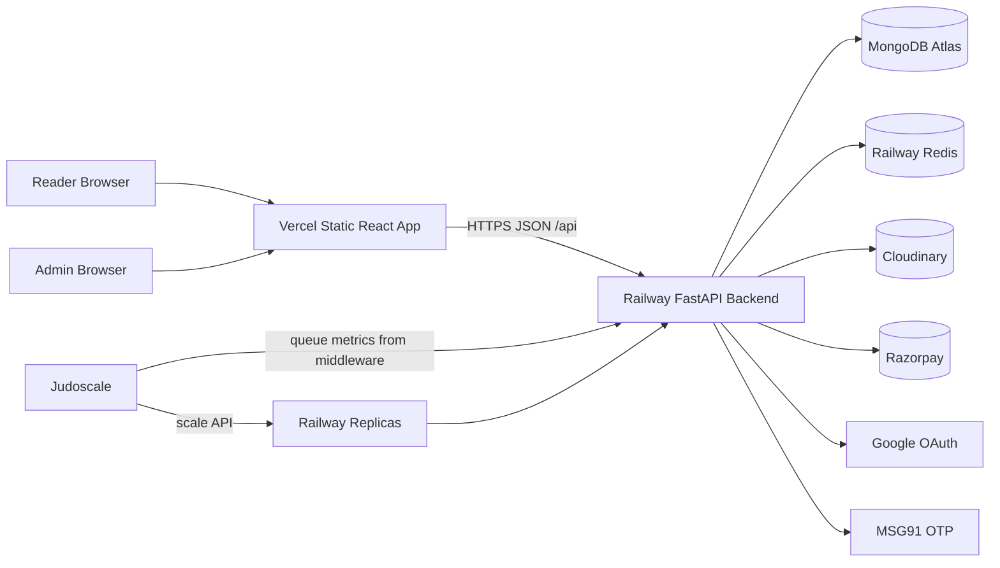

### HLD Responsibilities

| Layer | Responsibility |
| --- | --- |
| Vercel | Static frontend hosting, HTTPS, immutable asset caching, SPA rewrites, security headers. |
| React app | Public library UX, reader UX, account UX, admin dashboard, SEO metadata, API clients. |
| FastAPI app | Business rules, auth, reader gating, wallet accounting, payment verification, admin APIs. |
| MongoDB | Canonical persistence for books, chapters, users, wallets, payments, settings, and audit data. |
| Redis | Shared cache, shared rate-limit state, startup leader locks, replica-safe behavior. |
| Cloudinary | Image upload, cover optimization, responsive image URLs, chapter embedded images. |
| Razorpay | Payment order creation, payment verification, webhook events, wallet top-up crediting. |
| Judoscale | Horizontal autoscaling trigger based on backend queue time. |

## Low Level Design

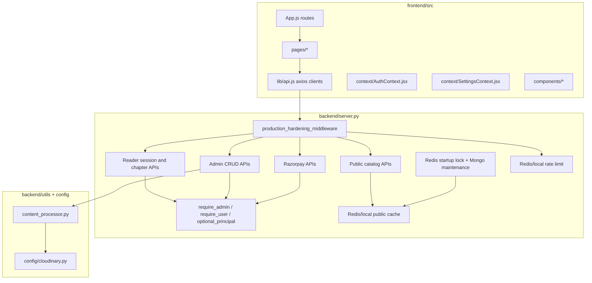

### Request Lifecycle

1. Browser loads static assets from Vercel.
2. React route renders a page and calls `frontend/src/lib/api.js`.
3. API request goes to `https://api.theearnalism.com/api/...`.
4. FastAPI middleware applies security headers, structured logging, rate limits, and graceful drain handling.
5. Auth dependencies validate JWTs and session state where needed.
6. Route handler reads/writes MongoDB and optionally Redis cache/locks.
7. Response returns sanitized JSON with no Mongo `_id`.

## Runtime Architecture

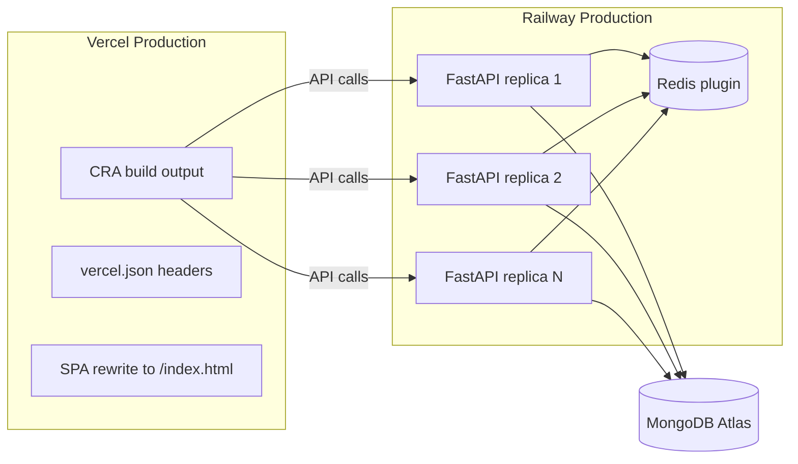

## Frontend Architecture

### Framework And Build

- Framework: React 19 with Create React App via CRACO.
- Router: `react-router-dom`.
- Icons: `lucide-react`.
- Notifications: `sonner`.
- Rich editor: TipTap for admin journal content.
- API transport: `axios`, with browser `fetch` for refresh/analytics/beacon paths.
- Styling: Tailwind + custom CSS variables in `frontend/src/index.css` and `App.css`.

### Frontend Routes

| Route | Page | Purpose |
| --- | --- | --- |
| `/` | `Home.jsx` | Landing page, shelves, featured books, newsletter capture. |
| `/library` | `Library.jsx` | Public catalog browsing and category filtering. |
| `/book/:slug` | `BookDetail.jsx` | Book metadata, table of contents, reader entry. |
| `/reader/:slug` | `Reader.jsx` | Full-screen reader, gated chapter access, wallet pulse billing. |
| `/journal` | `Journal.jsx` | Public journal list. |
| `/journal/:slug` | `JournalArticle.jsx` | Journal article detail. |
| `/pricing` | `Pricing.jsx` | Reading-time packs and Razorpay checkout. |
| `/login` | `Login.jsx` | Email, Google, and OTP user login. |
| `/signup` | `Signup.jsx` | Reader account creation. |
| `/account` | `Account.jsx` | Reader profile, wallet, transactions. |
| `/contact` | `Contact.jsx` | Contact form. |
| `/about` | `About.jsx` | About page. |
| `/admin/login` | `AdminLogin.jsx` | Admin login. |
| `/admin` | `Admin.jsx` | Admin dashboard for books, blog, categories, users, payments, settings. |

### Frontend State And API Clients

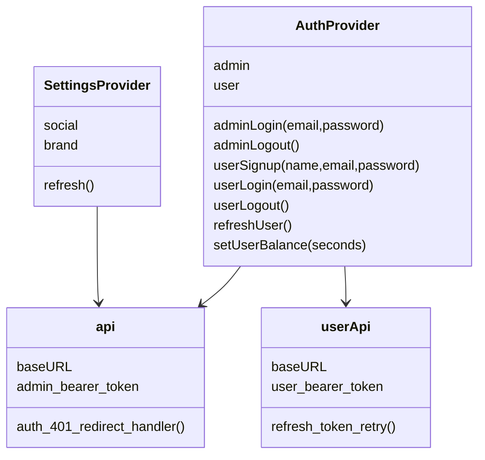

Important token keys:

- Admin JWT: `earnalism_admin_token`.
- Reader JWT: `earnalism_user_token`.
- Reader refresh token: HTTP-only cookie set by backend.

## Backend Architecture

### Framework And Runtime

- Runtime: Python 3.11 container on Railway.
- Web framework: FastAPI + Uvicorn.
- Database driver: Motor / PyMongo.
- Data validation: Pydantic.
- Cache/rate limits/locks: Redis when `MULTI_REPLICA_ENABLED=true`.
- Middleware: CORS, gzip, structured errors, security headers, rate limiting, graceful drain.
- Autoscaling metrics: `judoscale[asgi]`.

### Backend Components

| Component | Location | Responsibility |
| --- | --- | --- |
| `server.py` | `backend/server.py` | FastAPI app, models, auth, routes, billing, payments, cache, startup. |
| `content_processor.py` | `backend/utils/content_processor.py` | DOCX/MD/HTML/TXT chapter conversion, sanitization, image extraction. |
| `cloudinary.py` | `backend/config/cloudinary.py` | Cloudinary initialization, upload, responsive URLs. |
| `railway.json` | `backend/railway.json` | Railway build/start/health configuration. |
| `Dockerfile` | `backend/Dockerfile` | Container build and local Docker health check. |

### Backend Flowchart

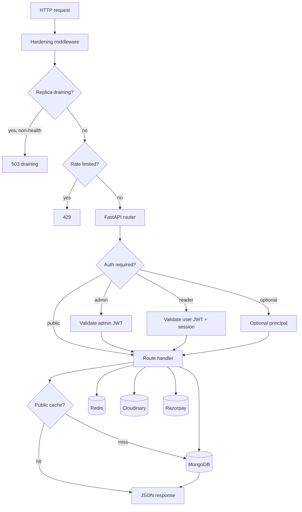

## Data Model And ERD

MongoDB collections are document-oriented. The main model stores chapters embedded in book documents because reader table-of-contents and chapter metadata are naturally book-scoped.

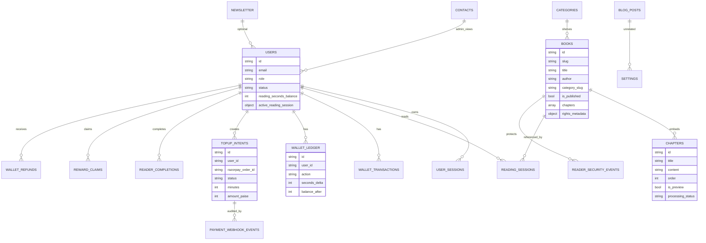

### Primary Collections

| Collection | Purpose |
| --- | --- |
| `users` | Admin and reader accounts, active session pointers, reading wallet balance. |
| `user_sessions` | Refresh-token backed reader sessions and trusted device state. |
| `books` | Book metadata, embedded chapters, cover fields, publication state, rights metadata. |
| `categories` | Canonical shelf taxonomy. |
| `blog_posts` | Journal posts. |
| `newsletter` | Reading Circle signups. |
| `contacts` | Contact form submissions and admin status. |
| `settings` | Featured book, social links, brand settings. |
| `reading_sessions` | Legacy/explicit reading sessions. |
| `wallet_transactions` | Reader-facing wallet transaction rows. |
| `wallet_ledger` | Canonical wallet accounting ledger. |
| `wallet_integrity_alerts` | Balance/ledger mismatch alerts. |
| `wallet_refunds` | Admin-approved refund findings and credits. |
| `topup_intents` | Razorpay order/intention records. |
| `payment_webhook_events` | Razorpay webhook audit log. |
| `analytics_events` | Funnel and performance analytics. |
| `reader_security_events` | Secure reader copy/print/context-menu/screenshot-key attempts. |
| `reader_completions` | Reader completion streak evidence. |
| `reward_claims` | Claimed reader rewards. |
| `credit_log` | Admin upload credit accounting. |
| `admin_upload_audit` | Admin upload audit artifacts, including GridFS refs in multi-replica mode. |
| `otp_store` | Temporary mobile OTP records. |

## Data Flow

### Public Catalog Data Flow

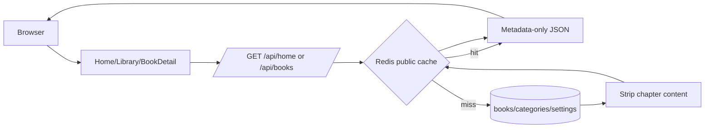

Public catalog endpoints intentionally remove chapter bodies. Full chapter content is fetched only through the gated reader endpoint.

### Reader Data Flow

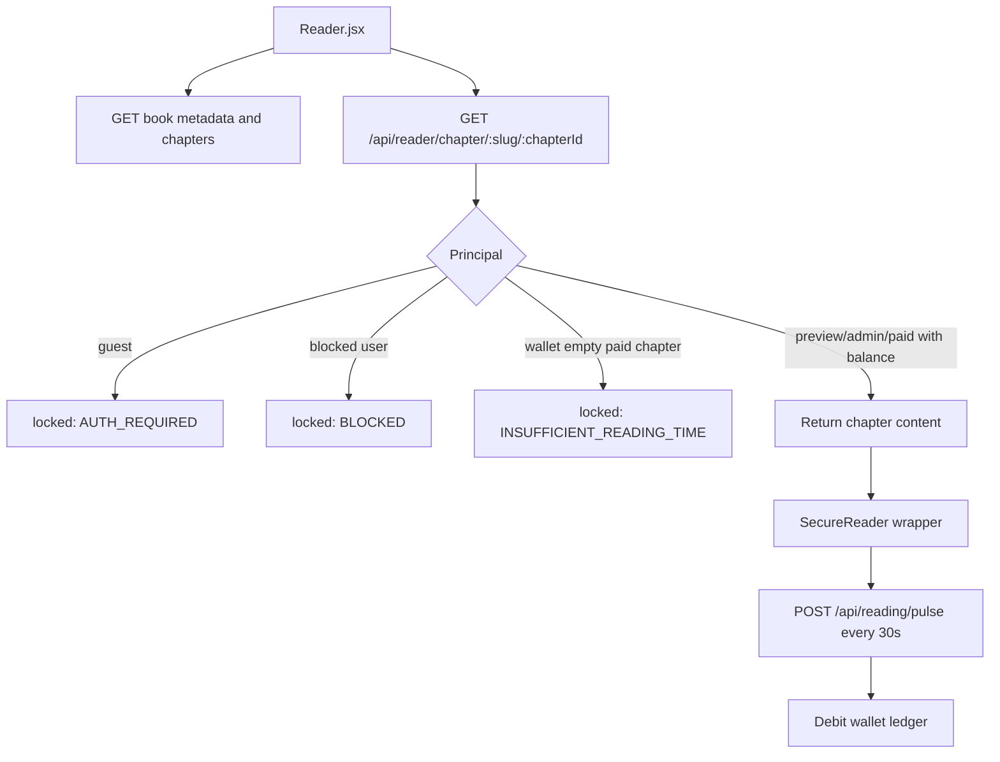

### Admin Publishing Data Flow

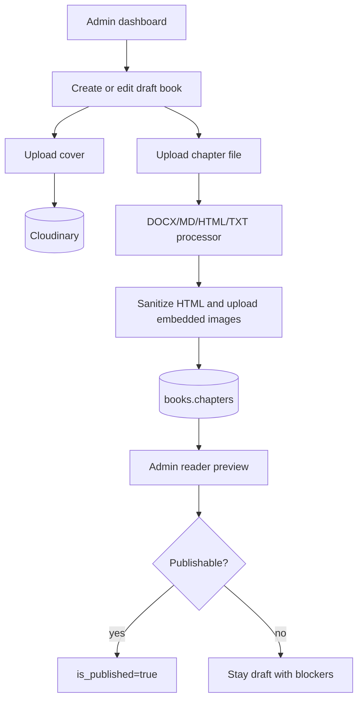

### Payment Data Flow

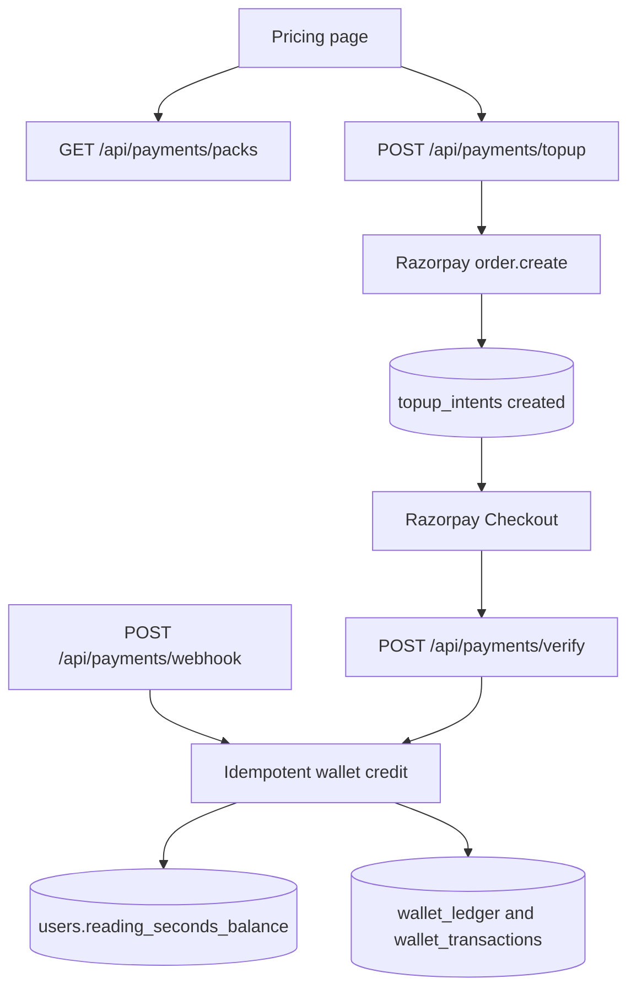

## API Surface

All backend API routes are under `/api` except root health aliases.

### Public

| Method | Route | Purpose |
| --- | --- | --- |
| `GET` | `/api/health` | DB-aware health payload. |
| `GET` | `/healthz`, `/api/healthz` | Lightweight Railway health check. |
| `GET` | `/api/home` | Combined cached home payload. |
| `GET` | `/api/categories` | Shelf list. |
| `GET` | `/api/books` | Published book list, metadata only. |
| `GET` | `/api/books/{slug}` | Published book detail, metadata and ToC only. |
| `GET` | `/api/books/{slug}/chapters` | Chapter metadata list. |
| `GET` | `/api/books/{slug}/chapters/{chapter_id}` | Preview chapter content only if free preview. |
| `GET` | `/api/blog` | Published journal posts. |
| `GET` | `/api/blog/{slug}` | Published journal detail. |
| `GET` | `/api/featured` | Featured book setting. |
| `POST` | `/api/newsletter` | Reading Circle signup. |
| `POST` | `/api/contact` | Contact form. |
| `GET` | `/api/settings/public` | Social + brand settings. |
| `GET` | `/api/payments/packs` | Reading-time packs. |
| `GET` | `/api/payments/config` | Razorpay public config status. |

### Reader Auth And Wallet

| Method | Route | Purpose |
| --- | --- | --- |
| `POST` | `/api/users/signup` | Email/password reader signup. |
| `POST` | `/api/users/login` | Reader login. |
| `POST` | `/api/users/logout` | Reader logout and refresh-cookie clearing. |
| `POST` | `/api/users/refresh` | Refresh reader access token. |
| `POST` | `/api/auth/google` | Google reader auth. |
| `POST` | `/api/auth/otp/request` | Request mobile OTP. |
| `POST` | `/api/auth/otp/verify` | Verify mobile OTP and login. |
| `GET` | `/api/users/me` | Reader profile. |
| `GET` | `/api/users/me/wallet` | Wallet balance. |
| `GET` | `/api/users/me/transactions` | Reader transaction history. |
| `GET` | `/api/users/me/rewards` | Completion reward state. |
| `POST` | `/api/users/me/rewards/completion` | Record chapter completion evidence. |
| `POST` | `/api/users/me/rewards/claim` | Claim streak reward. |

### Reader Sessions

| Method | Route | Purpose |
| --- | --- | --- |
| `GET` | `/api/reader/chapter/{slug}/{chapter_id}` | Gated chapter body endpoint. |
| `POST` | `/api/reading/session/start` | Start active reading session. |
| `POST` | `/api/reading/pulse` | 30-second reader billing pulse. |
| `POST` | `/api/reading/session/end` | End active reading session. |
| `GET` | `/api/reading/packs` | Simplified pack list for reader UX. |

Legacy aliases also exist under `/api/reader/session/start`, `/api/reader/heartbeat`, and `/api/reader/session/end`.

### Payments

| Method | Route | Purpose |
| --- | --- | --- |
| `POST` | `/api/payments/topup` | Create Razorpay top-up order. |
| `POST` | `/api/payments/verify` | Verify checkout signature and credit wallet. |
| `POST` | `/api/payments/webhook` | Razorpay webhook and audit handler. |
| `GET` | `/api/payments/me/intents` | Reader top-up intent history. |
| `POST` | `/api/payments/_simulate_topup` | Test-mode top-up simulation. |
| `POST` | `/api/payments/_simulate_webhook` | Test-mode webhook simulation. |

### Admin

| Method | Route | Purpose |
| --- | --- | --- |
| `POST` | `/api/auth/login` | Admin login. |
| `GET` | `/api/auth/me` | Admin profile. |
| `POST` | `/api/auth/change-password` | Admin password change. |
| `GET/POST/PUT/DELETE` | `/api/admin/books...` | Book CRUD, summary, detail. |
| `POST` | `/api/upload_docx` | Admin DOCX/template validator. |
| `POST` | `/api/admin/books/import-template` | Admin book template upload. |
| `GET` | `/api/credits/report` | Upload credit report. |
| `POST/PUT/DELETE` | `/api/admin/books/{slug}/chapters...` | Chapter CRUD and reorder. |
| `POST` | `/api/admin/books/{slug}/cover` | Cover upload. |
| `POST` | `/api/admin/books/{slug}/chapters/{chapter_id}/upload` | Chapter file upload. |
| `POST` | `/api/admin/upload/image` | Journal image upload. |
| `POST/PUT/DELETE` | `/api/admin/categories...` | Category management. |
| `GET/POST/PUT/DELETE` | `/api/admin/blog...` | Journal management. |
| `GET` | `/api/admin/newsletter` | Newsletter rows. |
| `GET/PATCH` | `/api/admin/contacts...` | Contact inbox and status. |
| `PUT` | `/api/admin/settings/social` | Social links. |
| `PUT` | `/api/admin/settings/brand` | Brand logo and OG image. |
| `PUT` | `/api/admin/featured` | Featured book setting. |
| `GET/PATCH` | `/api/admin/users...` | Reader list and status. |
| `POST` | `/api/admin/users/{uid}/wallet/adjust` | Manual wallet adjustment. |
| `GET` | `/api/admin/users/{uid}/wallet/refund-review` | Billing discrepancy scanner. |
| `POST` | `/api/admin/users/{uid}/wallet/refund-approve` | Approve selected refund candidates. |
| `GET` | `/api/admin/payments/intents` | Payment intent dashboard. |
| `GET` | `/api/admin/payments/webhooks` | Webhook audit dashboard. |
| `POST` | `/api/admin/payments/intents/{intent_id}/reconcile` | Manual payment reconcile. |
| `GET` | `/api/admin/secure-reader/alerts` | Reader protection alerts. |

## API Sequence Diagrams

### Public Browse And Preview

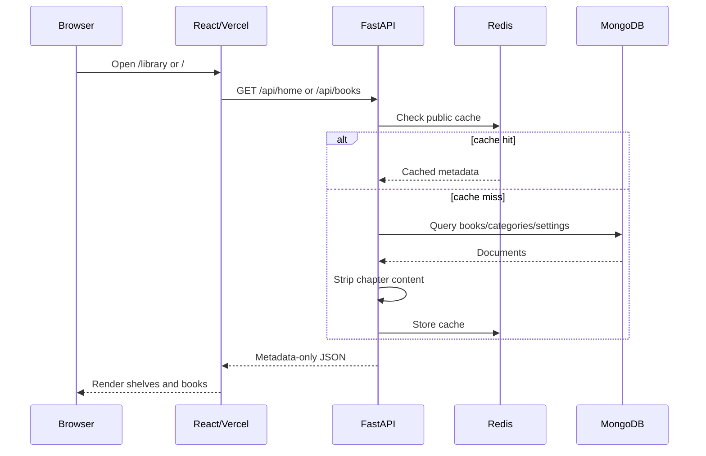

### Reader Login And Token Refresh

```mermaid
sequenceDiagram
  participant B as Browser
  participant FE as AuthProvider
  participant API as FastAPI
  participant M as MongoDB

  B->>FE: Submit login
  FE->>API: POST /api/users/login
  API->>M: Verify user and password
  API->>M: Create user_session
  API-->>FE: Access JWT + user; set refresh cookie
  FE->>FE: Save access JWT in localStorage
  FE->>API: GET /api/users/me
  API-->>FE: Reader profile

  Note over FE,API: On later 401
  FE->>API: POST /api/users/refresh with cookie
  API->>M: Rotate/validate refresh session
  API-->>FE: New access JWT
```

### Gated Reader Chapter

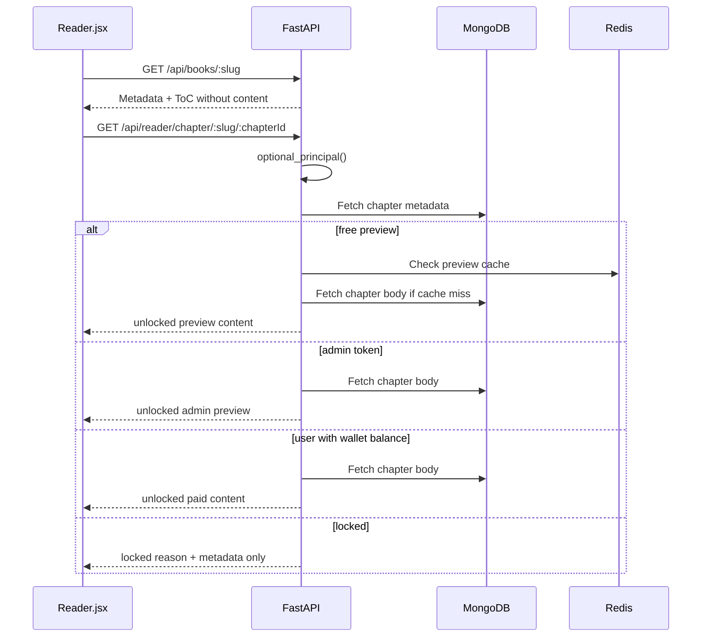

### Reading Pulse Billing

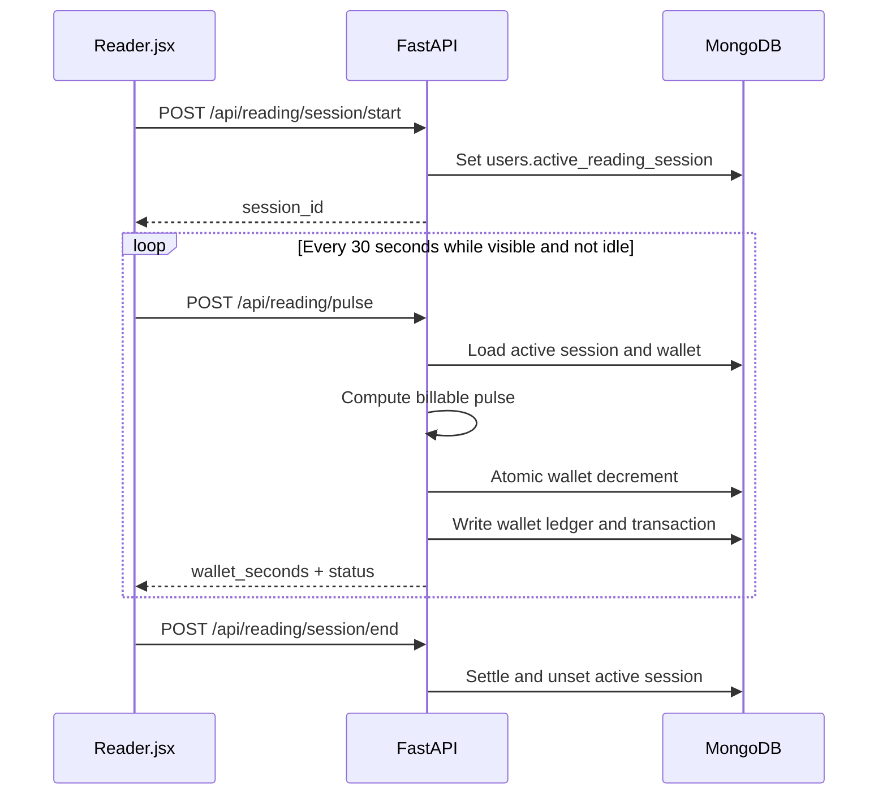

### Razorpay Top-Up

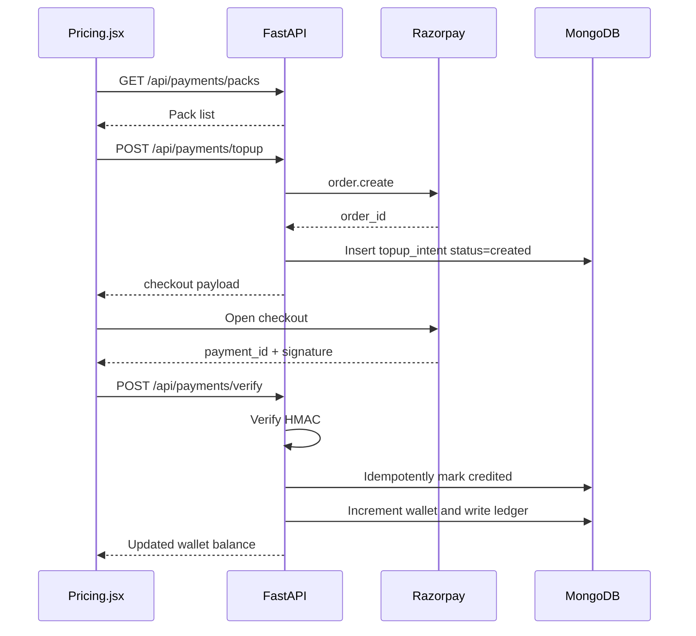

### Admin Book Upload

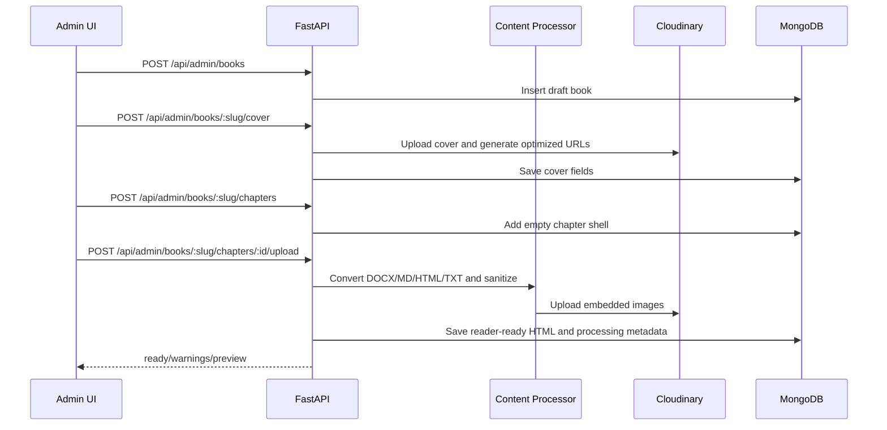

## Classes And Modules

### Backend Pydantic Models

| Class | Purpose |
| --- | --- |
| `LoginIn`, `ChangePasswordIn`, `TokenOut` | Admin auth input/output. |
| `Category`, `CategoryIn` | Shelf taxonomy. |
| `Chapter`, `ChapterIn`, `ChapterReorderIn` | Embedded book chapter model and admin chapter inputs. |
| `Book`, `BookIn` | Book metadata, publication state, covers, rights metadata, and embedded chapters. |
| `BlogPost`, `BlogPostIn` | Journal post model. |
| `NewsletterIn`, `ContactIn` | Public form inputs. |
| `SocialIn`, `BrandIn`, `FeaturedIn` | Site settings. |
| `UserSignupIn`, `UserLoginIn`, `UserOut`, `UserAuthOut` | Reader user auth and profile. |
| `GoogleAuthIn`, `OTPRequestIn`, `OTPVerifyIn` | Social/mobile auth inputs. |
| `WalletAdjustIn`, `WalletRefundApproveIn`, `WalletTransactionOut` | Wallet admin and transaction models. |
| `ReaderSessionStartIn`, `ReaderHeartbeatIn`, `ReaderSessionEndIn`, `ReadingPulseIn` | Reader session and pulse billing inputs. |
| `ReaderCompletionIn` | Reader reward completion evidence. |
| `AnalyticsEventIn`, `SecureReaderEventIn` | Funnel/performance/security event capture. |
| `UserStatusIn` | Admin block/unblock input. |
| `PackOut`, `TopUpCreateIn`, `TopUpCreateOut`, `PaymentVerifyIn`, `PaymentReconcileIn` | Payment pack, top-up, verification, and admin reconcile models. |

### Frontend Components And Modules

| Module | Purpose |
| --- | --- |
| `App.js` | Route tree, lazy route loading, high-intent route prefetch. |
| `AuthContext.jsx` | Admin and reader auth state, local token storage, logout, refresh helpers. |
| `SettingsContext.jsx` | Public social/brand settings. |
| `lib/api.js` | API base URL, axios clients, token injection, refresh retry, 401 redirects. |
| `Home.jsx`, `Library.jsx`, `BookDetail.jsx` | Public discovery and metadata pages. |
| `Reader.jsx` | Secure reader UI, chapter gating, text-to-speech, wallet pulse handling, reading rewards. |
| `SecureReader.jsx` | Client-side reader protection event capture. |
| `Pricing.jsx` | Pack list, Razorpay checkout, test-mode simulator path. |
| `Account.jsx` | Reader account and wallet history. |
| `Admin.jsx` | Admin dashboard tabs for content, users, payments, security, settings. |
| `ChapterUpload.jsx`, `CoverUpload.jsx`, `JournalEditor.jsx` | Admin upload/editor components. |
| `funnelAnalytics.js`, `performanceMetrics.js` | Analytics event capture. |
| `images.js` | Image normalization and optimized URL helpers. |

## Book Import And Publishing Pipeline

The repo includes admin UI upload and command-line bulk upload.

Always follow `AGENTS.md` for imports:

- Read `book_import_manifest.json` unless another manifest is provided.
- Download only legally cleared sources.
- Strip repository/license/source boilerplate from reader-facing content.
- Validate commercial-use rights before upload.
- Upload only passing books.
- Use draft mode by default.
- Keep source URLs and rights evidence internal/admin-only.
- Print uploaded IDs/slugs and skipped-book reasons.

Pipeline docs:

- `docs/NEW_BOOK_UPLOAD_GUIDE.md`
- `docs/BULK_PUBLISHING_PIPELINE.md`
- `scripts/import_books.py`
- `scripts/bulk_publishing_pipeline.py`
- `scripts/book_production_workflow.py`
- `scripts/earnalism_go_live.sh`

Canonical category slugs:

- `bengali-classics`
- `literary-fiction`
- `young-readers`
- `business`
- `technology`
- `history-strategy`
- `adventure`
- `science-fiction`
- `gothic-fiction`

## Security Model

### Authentication

- Admins use `/api/auth/login` and an admin JWT.
- Readers use email/password, Google OAuth, or mobile OTP.
- Reader access JWT is stored in localStorage.
- Reader refresh token is stored as an HTTP-only cookie.
- Reader sessions are single-active-session oriented; a newer login can invalidate older active sessions.

### Authorization

- `require_admin` gates admin APIs.
- `require_user` gates reader account, wallet, session, and payment APIs.
- `optional_principal` supports public/guest reader paths while unlocking admin/user paths when a valid token is present.

### Reader Content Protection

- Public book detail endpoints never return paid chapter bodies.
- `/api/reader/chapter/{slug}/{chapter_id}` is the only full-content reader endpoint.
- Secure reader events are captured for blocked copy, print, context-menu, drag, and screenshot-key attempts.
- Admins can review protection alerts in `/admin` -> `security`.

### HTTP And Platform Hardening

- Vercel security headers are configured in `frontend/vercel.json`.
- Backend adds structured error responses and security headers.
- Rate limits are bucketed by auth/payment/upload/public/reader/webhook path groups.
- In multi-replica mode, rate-limit counters are Redis-backed.
- Railway `/healthz` stays lightweight and uncached.

## Performance And Autoscaling

### Frontend

- Static CRA build on Vercel.
- Immutable caching for `/static/*`.
- SPA fallback rewrite to `/index.html`.
- Lazy page imports and idle-time prefetch for high-intent routes.

### Backend

- `/api/home` reduces landing-page fanout by bundling categories, books, and featured book.
- Public catalog endpoints are Redis-cacheable.
- Public catalog responses strip chapter bodies.
- MongoDB projections avoid shipping full embedded chapters unless required.
- Mongo pool defaults are tuned for multi-replica mode:
  - `MONGODB_MAX_POOL_SIZE=25`
  - `MONGODB_MIN_POOL_SIZE=1`
  - `MONGODB_MAX_CONNECTING=2`
  - `MONGODB_SERVER_SELECTION_TIMEOUT_MS=15000`
  - `MONGODB_WAIT_QUEUE_TIMEOUT_MS=5000`

### Railway Autoscaling

See `RAILWAY_SCALING_SETUP.md`.

Current design:

- Railway Pro backend service.
- `MULTI_REPLICA_ENABLED=true`.
- Redis provisioned through Railway.
- Judoscale ASGI middleware enabled by `JUDOSCALE_URL`.
- Judoscale range: min 2, max 10.
- Scale-up quantity: 2 replicas.
- Scale-up sensitivity: 10 seconds.
- Downscale interval: 300 seconds.
- Startup maintenance guarded by Redis leader lock.
- Graceful SIGTERM drain window: 15 seconds.

## Deployment

### Frontend: Vercel

Project root: `frontend/`.

Local build:

```bash
cd frontend
npm run build
```

Production deploy:

```bash
cd frontend
npx --yes vercel@latest deploy --prod --yes --force
```

Verify:

```bash
curl -I https://theearnalism.com
curl -s https://theearnalism.com/asset-manifest.json | head
```

The deployed Vercel project is linked by `frontend/.vercel/project.json`.

### Backend: Railway

Project root for deployment: `backend/`.

Health:

```bash
curl https://api.theearnalism.com/healthz
curl https://api.theearnalism.com/api/healthz
```

Deploy from local source:

```bash
railway up ./backend --path-as-root --service earnalism --environment production --detach
```

Check status:

```bash
railway deployment list --service earnalism --environment production --limit 5 --json
railway metrics --service earnalism --environment production --json
```

## Local Development

### Backend

```bash
cd backend
python3 -m venv .venv
source .venv/bin/activate
pip install -r requirements.txt
cp .env.example .env
uvicorn server:app --host 0.0.0.0 --port 8000 --reload
```

Minimum backend variables:

- `MONGODB_URL`
- `DB_NAME`
- `JWT_SECRET`
- `ADMIN_EMAIL`
- `ADMIN_PASSWORD`
- `FRONTEND_URL`
- `CORS_ORIGINS`

Optional integrations:

- `CLOUDINARY_CLOUD_NAME`, `CLOUDINARY_API_KEY`, `CLOUDINARY_API_SECRET`
- `RAZORPAY_KEY_ID`, `RAZORPAY_KEY_SECRET`, `RAZORPAY_WEBHOOK_SECRET`
- `GOOGLE_CLIENT_ID`, `GOOGLE_CLIENT_SECRET`
- `MSG91_AUTH_KEY`, `MSG91_TEMPLATE_ID`
- `REDIS_URL`, `MULTI_REPLICA_ENABLED`
- `JUDOSCALE_URL`

### Frontend

```bash
cd frontend
npm install --legacy-peer-deps
REACT_APP_BACKEND_URL=http://localhost:8000 npm start
```

For production API during local frontend development:

```bash
REACT_APP_BACKEND_URL=https://api.theearnalism.com npm start
```

## Testing And Regression

Root scripts:

```bash
npm run regression
npm run loadtest
npm run load:100
npm run load:10x
```

Focused backend tests:

```bash
python3 -m pytest \
  backend/tests/test_content_processor_safety.py \
  backend/tests/test_bengali_content_pipeline.py \
  backend/tests/test_reader_billing_policy.py
```

Frontend build:

```bash
cd frontend
npm run build
```

Scale docs:

- `docs/REGRESSION_AND_SCALE.md`
- `RAILWAY_SCALING_SETUP.md`

## Operations Runbook

### FE Go-Live

1. Ensure git is clean or intended changes are committed.
2. Run `cd frontend && npm run build`.
3. Run `npx --yes vercel@latest deploy --prod --yes --force`.
4. Confirm alias to `https://theearnalism.com`.
5. Smoke check home and `asset-manifest.json`.

### BE Go-Live

1. Run focused tests.
2. Deploy backend with Railway CLI.
3. Confirm `/healthz` and `/api/healthz`.
4. Check Railway deployment status and metrics.
5. Watch logs for Mongo, Redis, or payment errors.

### Emergency Backend Scale Override

```bash
railway scale --service earnalism --environment production us-west=8
```

After the spike:

```bash
railway scale --service earnalism --environment production us-west=0
```

Judoscale should normally handle this automatically.

### Payment Reconcile

1. Open `/admin`.
2. Go to `payments`.
3. Review top-up intents and webhook events.
4. Use admin reconcile only when payment evidence is valid and the webhook did not credit.

### Billing Refund Review

See `docs/WALLET_REFUND_PIPELINE.md`.

## Known Maintenance Notes

- `frontend/src/pages/Reader.jsx` contains a legacy call to `/payments/create-order` in one top-up path; the backend currently exposes `/payments/topup`, and `Pricing.jsx` uses the correct endpoint.
- `docs/REGRESSION_AND_SCALE.md` still references older Mongo pool defaults in one historical section; the current backend defaults are documented in this README and `RAILWAY_SCALING_SETUP.md`.
- `DEPLOYMENT.md` describes an older Hostinger VPS path. Current production is Vercel frontend plus Railway backend.

## Useful Links

- Frontend production: `https://theearnalism.com`
- Backend health: `https://api.theearnalism.com/healthz`
- Book upload guide: `docs/NEW_BOOK_UPLOAD_GUIDE.md`
- Bulk pipeline guide: `docs/BULK_PUBLISHING_PIPELINE.md`
- Scaling setup: `RAILWAY_SCALING_SETUP.md`
- Regression and load gates: `docs/REGRESSION_AND_SCALE.md`
