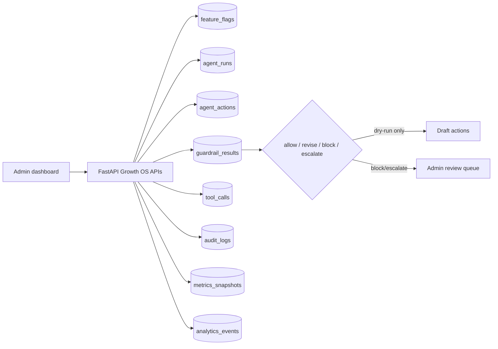
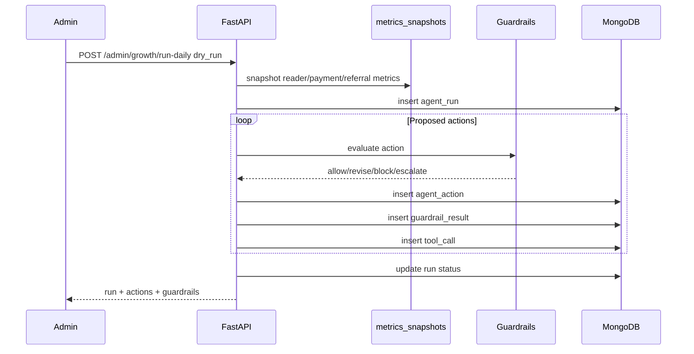

# Earnalism Growth OS

Earnalism Growth OS is a guardrailed growth control plane for reader acquisition, onboarding, retention, referrals, institution outreach, creator partnerships, support, and operational safety.

The first implementation is intentionally deterministic. It provides the agent registry, tool registry, hard policy gates, audit logs, budgets, feature flags, admin dashboard, and a dry-run daily loop. Public/customer-facing execution remains disabled until the operator explicitly changes both environment flags and feature flags.

## High-Level Design



## Low-Level Design

Backend:

- `GET /api/admin/growth/overview` returns agents, tools, guardrails, budgets, flags, recent runs, blocked actions, incidents, and the latest metrics snapshot.
- `POST /api/admin/growth/run-daily` creates one deterministic daily-loop run and stores every proposed action, guardrail result, and tool-call record.
- `POST /api/admin/growth/kill-switch` updates only `growth_os*` feature flags and writes an audit event.

Frontend:

- Admin tab: `growth`
- Actions: refresh overview, run safe dry-run, emergency pause/resume.
- Visibility: budget gates, latest metrics snapshot, agent registry, recent runs, and guardrail history.

## Collections

The current production app uses MongoDB, so Growth OS follows the existing data layer instead of introducing PostgreSQL midstream.

- `campaigns`
- `campaign_variants`
- `experiments`
- `leads`
- `institutions`
- `creators`
- `outreach_sequences`
- `messages`
- `support_tickets`
- `agent_runs`
- `agent_actions`
- `guardrail_results`
- `tool_calls`
- `incidents`
- `budgets`
- `metrics_snapshots`
- `audit_logs`
- `feature_flags`

Existing collections reused:

- `users`
- `books`
- `reading_sessions`
- `topup_intents`
- `analytics_events`

## Agent Model

Every agent has:

- `id`
- `name`
- `instructions`
- `allowed_tools`
- `blocked_actions`
- `rate_limits`

Agents included:

- Growth Commander Agent
- Strategy Agent
- Content Agent
- SEO Agent
- Outreach Agent
- Institution Sales Agent
- Creator Partnership Agent
- Referral Agent
- Customer Success Agent
- Support Agent
- Analytics Agent
- Trust and Compliance Agent
- Availability Agent
- Finance Guard Agent

## Guardrails

Guardrails run before any action record is considered approved:

- copyright and licensing risk
- false or exaggerated claims
- spam-like messaging and excessive frequency
- children/student appropriateness
- political/religious/cultural sensitivity
- privacy and personal data exposure
- pricing, refund, payment, or discount risk
- unsupported book availability claims
- hallucinated testimonials
- hallucinated partnerships
- budget overrun

Decisions:

- `allow`
- `revise`
- `block`
- `escalate_to_admin_queue`

## Daily Loop



## Production Safety

Default production env:

```bash
GROWTH_OS_ENABLED=true
GROWTH_OS_DRY_RUN_ONLY=true
GROWTH_OS_PUBLIC_EXECUTION_ENABLED=false
```

Production execution requires:

1. `GROWTH_OS_DRY_RUN_ONLY=false`
2. `GROWTH_OS_PUBLIC_EXECUTION_ENABLED=true`
3. `growth_os_public_execution` feature flag enabled
4. No `growth_os_emergency_pause`
5. Passing guardrails

## Next Phases

1. Add scheduled daily trigger after dry-run reports are trusted.
2. Add admin review queues for escalated actions.
3. Add provider adapters for email, WhatsApp, CRM, social scheduling, and OpenAI Agents SDK orchestration.
4. Add budget ledger enforcement before spend, coupon, or partnership actions.
5. Add PostHog/Metabase dashboards over `analytics_events` and `metrics_snapshots`.
6. Add Sentry or equivalent for incident correlation.
